Flood Preparedness in the Caribbean
====================================

The services developed for the Use Case 1 – Flood Preparedness in the
Carribean - support both the reconstruction of past flood events and the
forecasting of analogous events.

The core idea is to use historical flood data, identified by the user
within the target areas, to build a comprehensive set of possible
flooded areas. This collection of reference events can then serve as
analogous scenarios whenever a new flood event is expected to impact the
region.

By linking each reconstructed event to clear triggers, the platform
enables decision-makers to anticipate potential impacts more
effectively, improve preparedness measures, and support timely response
actions.

In this tutorial will be presented:

-  How to access the flood extent archive of past event for Country.

-  How to add trigger as metadata to flood extent maps, through the
   **Flood Map Labeling.**

-  How to retrieve flood extent maps of pas event that were generated by
   specific trigger trough the **Map Fetching By Metadata.**

Past event reconstruction archives
--------------------------------------

For Belize, all the flood extent maps produced for past events have been
organized across two workspaces:

1. | **Archive workspace**
   | *Name:* **FEM_archive_BELIZE**
   | Workspace with all the flood extent maps produced for single dates.

2. | **Operational workspace**
   | *Name:* **FEM_archive_BELIZE_operational**
   | Workspace containing all flood extent maps produced for individual
     dates, some of which are already labeled.

You can access the archive workspaces in two ways:

1. Direct Links:

-  Archive workspace link: :raw-html:`<a href="https://coplac.wasdi.net/#/edit/361d28fe-bfb2-4610-9726-117aaa8f6235" target="_blank">WASDI 2.0 - FEM_archive_BELIZE</a>`

-  Operational workspace link: :raw-html:`<a href="https://coplac.wasdi.net/#/edit/f8ee1e1c-a9d8-4a30-9e4e-3babcbf22054" target="_blank">WASDI 2.0 – FEM_archive_BELIZE_operational</a>`

2. | From the workspaces manager section:
   | Both *COPLAC_UC2_archivo* and *COPLAC_UC2_operacional* are visible
     in your workspaces list, as shown in Figure 9) if you are
     **correctly registered as a UC1 CopernicusLAC user** (check the
     :ref:`Access the platform<access-platform-uc2>` section).

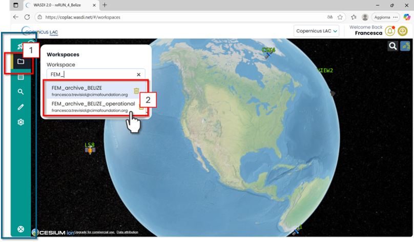

Figure 1. CopernicusLAC Flood Extent Mapping Archive – Accessing from
the CopernicusLAC Workspace Menu the dedicated *FEM_archive_BELIZE* or
*FEM_archive_BELIZE_operacional* workspaces.

In the full archive workspace, the panel at the top left of the
interface displays a list of all available layers (Figure 10). These
include all processed data from 2015 to the present. The data are
continually updated on the workspaces as soon as they have been
processed.

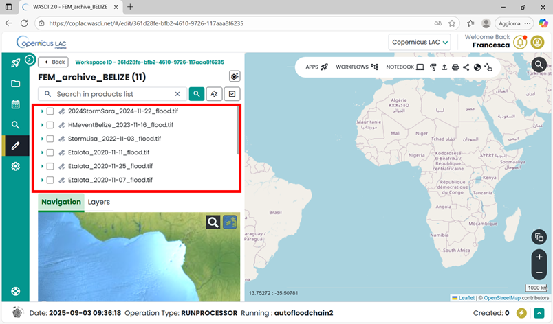

Figure 2. CopernicusLAC – Flood Frequency Mapping Service Workspace

Flood Map Labelling
--------------------------------------

To add trigger information to the existing flood extent maps as
metadata, the Flood Map Labeling available in the marketplace can be
used. Open the application.

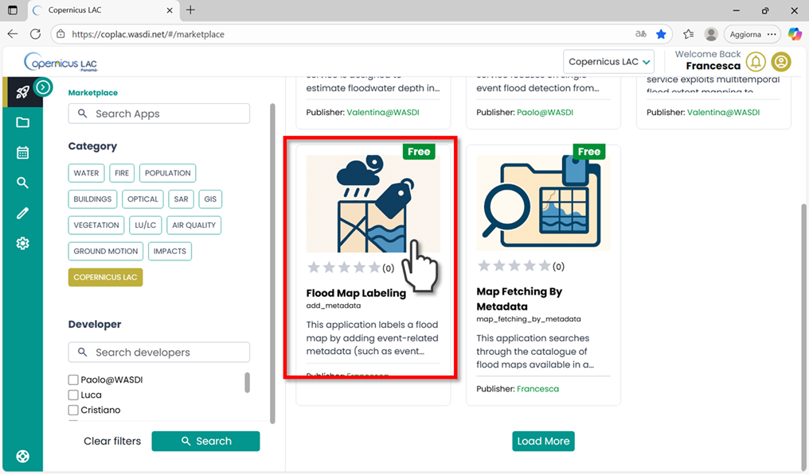

Figure 3. Flood Map Labeling in the CopernicusLAC Specialized PE
Marketplace.

Every app has its **Main Menu** on the left side of the user interface.
This is where you can access different tabs to configure parameters for
running the app.

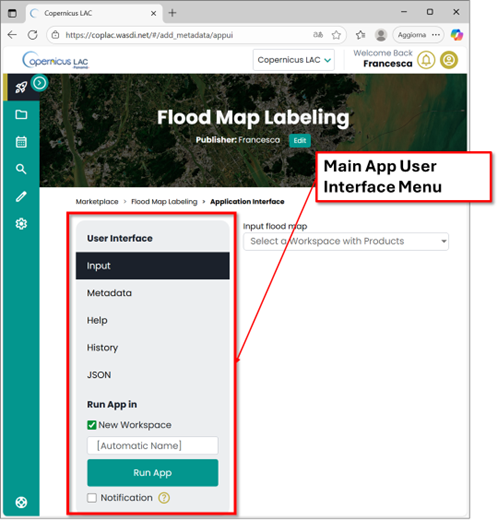

Figure 4. Flood Map Labeling user interface

The **Flood Map Labeling** app requires a **flood extent map** as input.
This means you must run the app in the **workspace where the flood
extent map is stored**.

To begin:

-  Scroll to the bottom of the **Main Menu**.

-  In the **“Run App in”** section, select the **“Existing
   Workspace”** option.

-  A dropdown menu will appear, allowing you to choose from your
   previously created workspaces.

-  Select the workspace that contains the flood extent map you want to
   add metadata to.

**Note**: If you haven’t already generated a flood extent map in your
workspace, you can create one using the **Flood Extent Mapping Service
App**: `https://coplac.wasdi.net/#/cl_flood_extent/appDetails`.

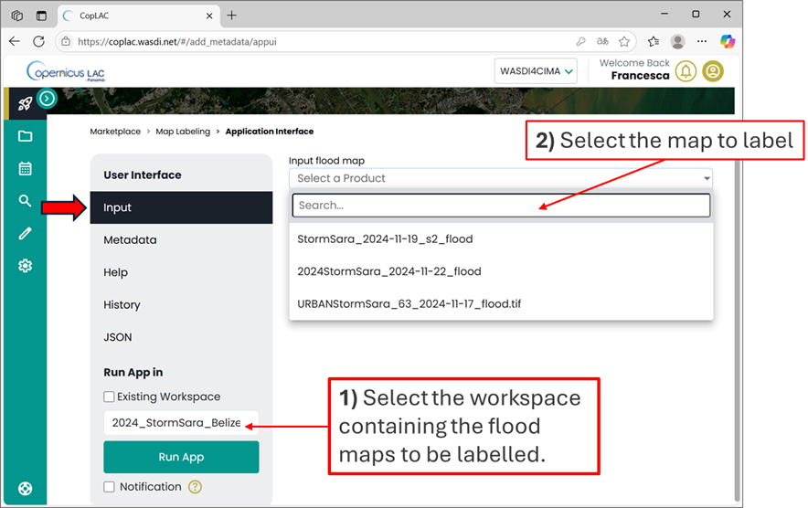

Figure 5. Flood Map Labeling user interface – Input

Click on the Metadata section, to fill the form with the values
associated with the identified variables:

-  Select Weather Event Type: Hurricane, Storm or General HM event

-  Storm surge [m]

-  Wind speed [km/h]

-  Forecasted rainfall [mm]

-  Tidal surge [m]

-  Wind gust [m/s]

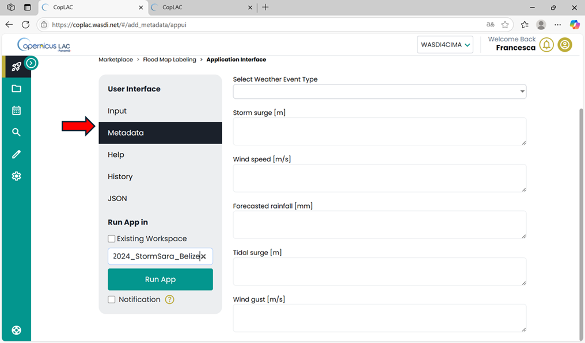

Figure 6. Flood Map Labeling user interface – Metadata

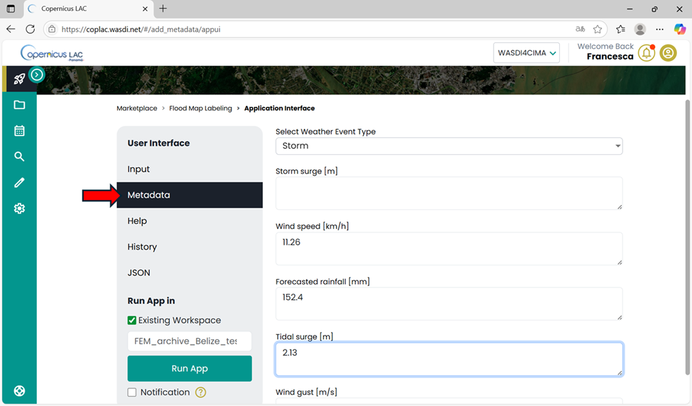

Figure 7. Flood Map Labeling user interface – Metadata example of trigger

Once all the available metadata fields are completed, start the
processing by clicking the **“Run App”** button in the **Main Menu**.
The platform will automatically redirect you to the selected workspace.

In the workspace, two new layers will appear:

-  **[input_flood_map_name]_label**: A flood extent map labeled with the
   provided variables. This file is intended for visualization.

-  **[input_flood_map_name]_label_metadata**: A flood extent map labeled
   with the provided variables. This file is designed to display the
   updated metadata directly on the platform.

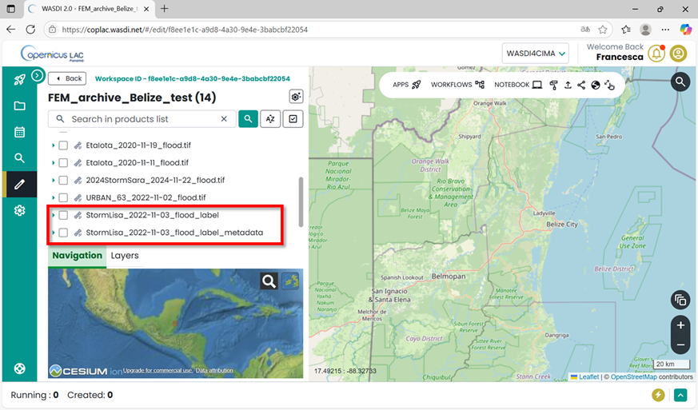

Figure 8. Output of the Flood Map Labeling app.

To display the flood extent map:

1. Toggle to the selected layer (**[input_flood_map_name]_label**).

2. Expand the selection until you reach the **“band”** section.

3. Click the **lightbulb** icon to visualize the map.

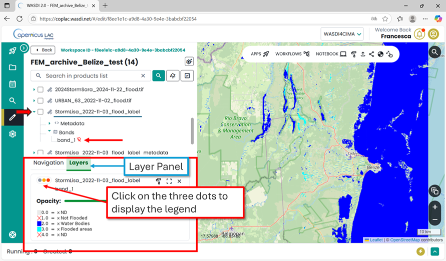

Figure 9. Visualization of flood extent map

To visualize the newly added metadata:

1. Select the corresponding **[input_flood_map_name]_label_metadata**
   file in the list.

2. Expand the selection and click on **“metadata”**.

3. A dialog message will appear, notifying you that the metadata are
   being generated.

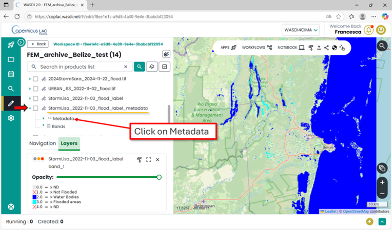

Figure 10. Access the metadata

.. image:: ../_static/UC1_tutorial/image11.png
   :width: 5.09325in
   :height: 2.99213in

Figure 11. Generating metadata

Wait a few seconds, then open the **metadata** section and double-click
on **“Image info”**. The metadata will then be displayed in the
interface.

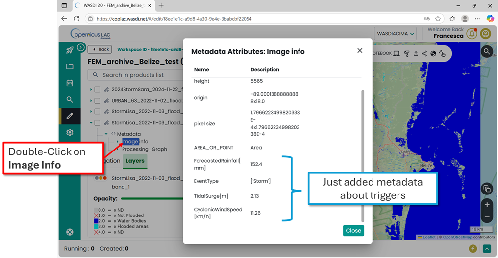

Figure 12. Metadata displayed in the Specialized PE.

Map Fetching By Metadata
--------------------------------------

To retrieve from the archive the flood maps that were generated for
specific flood events with specific weather conditions, users can use
the Map Fetching by Metadata available in the marketplace.

Open the application, in the main menu, in the bottom “Run App in”
section select the workspace where the labelled flood extent maps are
stored.

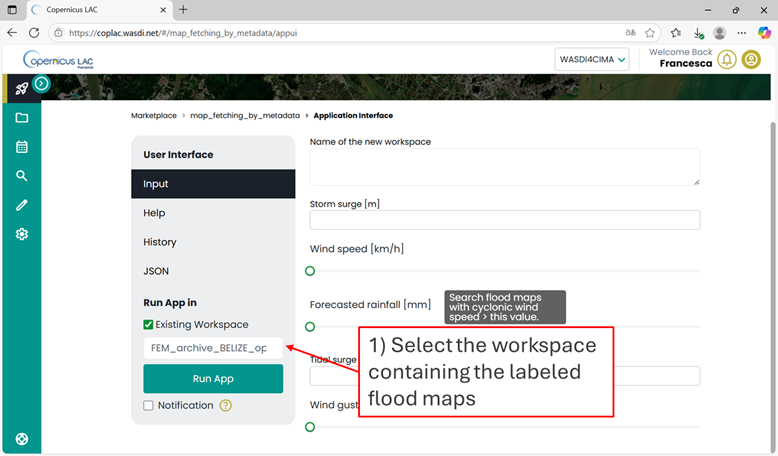

Figure 13. Map Fetching By Metadata – Run the app in the workspace where
the label data are stored

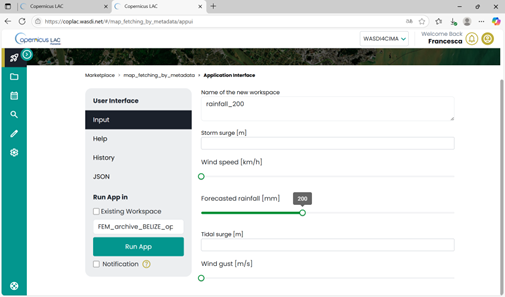

Figure 14. Map Fetching By Metadata – Set the input parameters

**Set the filters on the parameters for your query. Keep in mind that:**

-  The search will retrieve flood maps with trigger values **greater
   than or equal to** the value you set.

-  The search is currently designed to retrieve **all maps that satisfy
   at least one** of the search parameters.

Once all parameters are set, click the **“Run App”** button in the Main
Menu. The platform will automatically redirect you to the workspace you
selected (the archive).

After few seconds in the list of your workspace, in the workspace menu,
you will find the new one, for this example “\ *rainfall_200*\ ”

**Open “rainfall_200”** and you will see the list of flood extent maps
satisfying your query. In this example, you will retrieve the flood
extent maps with associated forecasted rainfall > 200 mm.

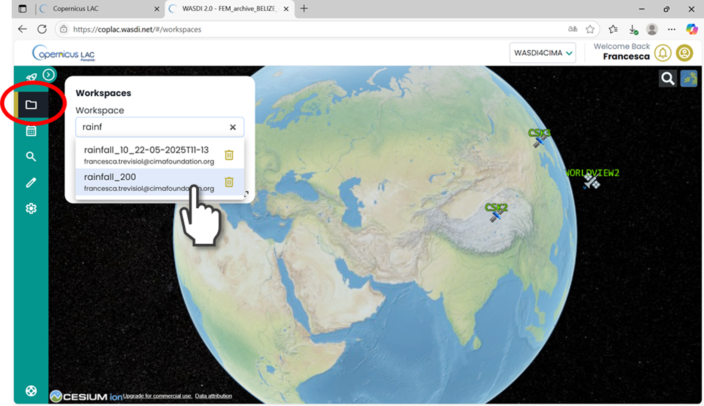

Figure 15. Access the new workspace just created

.. image:: ../_static/UC1_tutorial/image16.png
   :width: 6.77222in
   :height: 3.97847in

Figure 16. New workspace with the maps that satisfied the input parameters
of the query

Output, data visualization and download
-------------------------------------------

The service will produce as output the following GeoTIFF:

-  “\ **[CODE]_[DATE]_flood.tiff**\ ”: Flood extent map from SAR
   Sentinel-1 data acquired on [DATE] (legend 1);

-  “\ **[CODE]_[DATE]_s2-flood.tiff**\ ”: Flood extent map from optical
   Sentinel-2 data acquired on [DATE] (legend 1);

-  “\ **[CODE]_[StartDate]_[EndDate]_sar_flood_sum_days_[N].tif**\ ”
   Cumulative maximum extent computed from the available SAR-derived
   flood extent maps in the N days interval defined by StartDate and
   EndDate (legend 1).

-  “\ **[CODE]_dateStart_dateEnd_flood_sum_days_[N].tif**\ ” Cumulative
   maximum extent computed from the available SAR and optical derived
   flood extent maps in the N days interval defined by dateStart and
   dateEnd (legend 1).

-  “\ **[CODE]_dateStart_dateEnd_flood_frisk_[N].tif**\ ” Comparative
   map that compares optical and SAR derived flood extent maps in the
   interval (legend 2)

*Legend 1*:

   0 - No Data

   1 - No Flood

   2 - Permanent Water

   3 - Flooded Areas

*Legend 2*:

   0 - No Data

   1 - No Flood

   2 - One Map flood, the other one not flood

   3 - One Map flood, the other one no data

   4 - Both Maps flood

   5 - Permanent Water

You can either visualize the layers directly within the Specialized PE
workspace or download them to your local device for further processing.

*How to display data in your workspace in the Specialized PE?*

-  Find your layer of interest in your workspace, expand the selection
   and toggle on the layer of interest and click on the lightbulb icon.

-  The selected layer will be displayed on the map, and the product
   should appear in the list of products in the Layer panel (Figure 11).

.. image:: ../_static/UC1_tutorial/image17.png
   :width: 5.36038in
   :height: 3.14961in

Figure 17.CopernicusLAC Specialized PE map visualization

*How to download data from your workspace in the Specialized PE?*

-  Access your CopernicusLAC Specialized PE workspace

-  Find your layer of interest in your workspace, and select it (Figure
   12 - 1). The download option will appear on top the layer list
   (Figure 12 - 2).

   .. image:: ../_static/UC1_tutorial/image18.png
      :width: 5.35851in
      :height: 3.14961in

Figure 18. CopernicusLAC SpecializedPE data download
