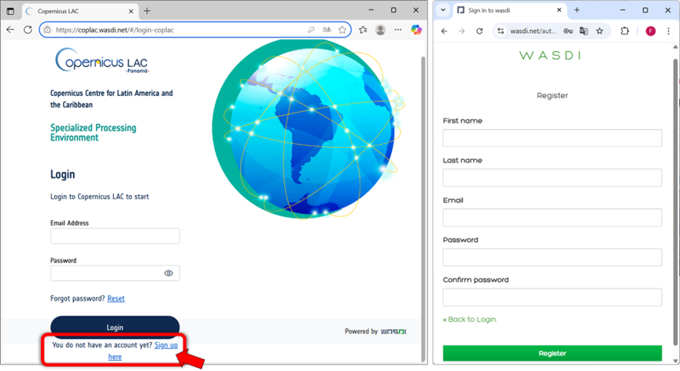
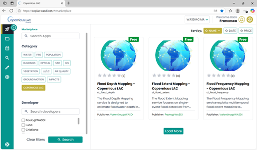
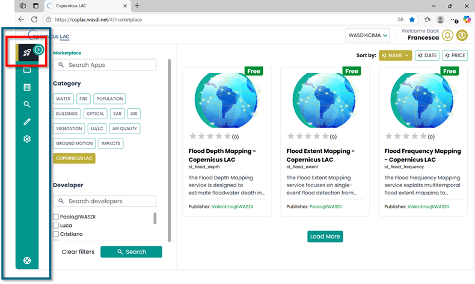
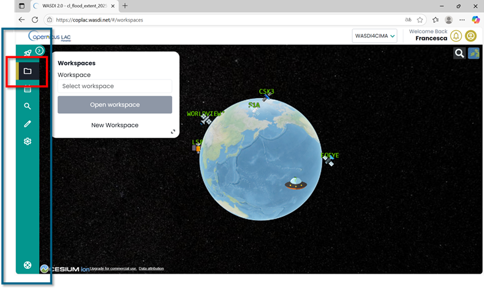
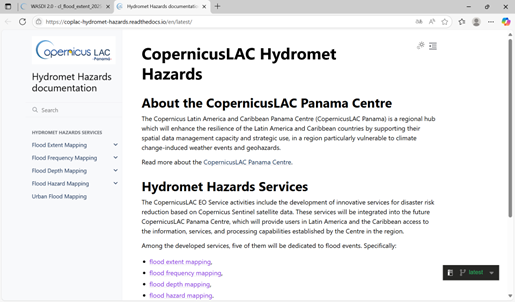

Flood Frequency Mapping Service - UC2
=======================================

Service summary
-------------------

The Flood Frequency Mapping (FFM) service exploits multitemporal flood
extent mapping to generate a flood frequency map that illustrates flood
occurrence patterns. The service relies on flood maps derived from both
optical and SAR data that are systematically analysed over the entire
Sentinel-2 (L2A) and Sentinel-1 (GRD) archive from 2015 to 2024, with
regular updates. The service operates independently of user triggers,
generating updated flood extent maps using Sentinel-1 and Sentinel-2
data and an automated change detection algorithm. Over time, the full
stack of these flood extent maps is analysed to produce the
comprehensive flood frequency map that shows the recurrence of flooding
across the AOI, that for Use Case 2 is the Mojana region (Colombia).

The FFM service has an initial execution to compute the flood frequency
of the full 2015-2024 archive. Afterwards, the flood frequency map is
updated every six months, incorporating all new Sentinel-1 and
Sentinel-2 acquisitions in the analysis.

The service has been developed by CIMA Research Foundation and WASDI
Sarl and is available through the CopernicusLAC Specialized Processing
Environment (PE), powered by WASDI Sarl.

.. _access-platform-uc2:

Access the platform
--------------------

The landing page of the CopernicusLAC Specialized PE is available at:
:raw-html:`<a href="https://coplac.wasdi.net/" target="_blank">https://coplac.wasdi.net/</a>`

To access the Specialized PE with the developed services and data, you
first need to create your account.

-  The Specialized PE is available through: :raw-html:`<a href="https://coplac.wasdi.net/#/login-coplac" target="_blank">https://coplac.wasdi.net/#/login-coplac</a>` 

-  Click on the **You do not have an account yet?** :raw-html:`<a href="https://www.wasdi.net/auth/realms/wasdi/protocol/openid-connect/registrations?client_id=wasdi_client&redirect_uri=https%3A%2F%2Fwww.wasdi.net%2F%23%2Flogin&state=74f70630-4138-4022-94fd-1b9743ca5175&response_mode=fragment&response_type=code&scope=openid&nonce=e55a5a23-1292-40d2-8674-267fbaf12950" target="_blank">Sign up here</a>` link

Figure 1. CopernicusLAC Specialized PE Login page and Sign-up form

-  **Fill out the registration form** with the following information:

   -  First Name, Last Name

   -  a valid e-mail address (that will be used as your **UserId**)

   -  password

-  Confirm your email address: You will receive a confirmation email.
   Click the link in that email to verify your address. Once confirmed,
   you will be able to access the SpecializedPE platform.

-  After registering, please send an email to business-team@wasdi.cloud
   with the following information:

   -  Confirmation that you have registered on the platform;

   -  **Email address** you used during registration

   -  Note stating that you are a *CopernicusLAC user – Use Case 2*.

The latter step is necessary so we can assign you the appropriate subscription.

After registering, you can log in with your credentials. You will be
redirected to the **Marketplace** page
(:raw-html:`<a href="https://coplac.wasdi.net/#/marketplace" target="_blank">https://coplac.wasdi.net/#/marketplace</a>`)
where the available **Service Applications** are listed.

Figure 2. CopernicusLAC Specialized PE Marketplace

Overview of the Specialized PE graphical interface
--------------------------------------------------

This section provides a general overview of the key components and
layout of the Specialized Processing Environment (PE) user interface.

The main menu is always visible on the green bar on the left-hand side
of the interface, allowing you to navigate through the various sections
of the platform.

.. image:: ../_static/UC2_tutorial/image4.png
   :width: 5.26572in
   :height: 3.14961in

Figure 3. CopernicusLAC Specialized PE main menu

-  **Marketplace:** page where all the applications are available for
   end users’ with a simple and intuitive Interface. Choose your App,
   set your input data and get your results.

Figure 4. CopernicusLAC Specialized PE main menu – Marketplace

-  **Workspaces**: each user can work in one or more Workspaces. A
   Workspace is a collection of files (either original Earth Observation
   (EO) data or outputs generated by processing tools) grouped under the
   same “project.”

   From the Workspace section, you can:

   -  Create a new workspace

   -  Open an existing workspace from the dropdown list of workspaces
      your account has access to

Figure 5. CopernicusLAC Specialized PE main menu – Workspaces

Below is an example of an existing workspace, showing the list of
available layers on the left and a basemap on the right, where selected
layers can be visualized.

.. image:: ../_static/UC2_tutorial/image7.png
   :width: 5.36131in
   :height: 3.14961in

Figure 6. CopernicusLAC Specialized PE – Example of workspace

-  **Documentation**: detailed specifications of the Hydromet Hazard
   Services are always accessible via the documentation link in the main
   menu.

.. image:: ../_static/UC2_tutorial/image8.png
   :width: 5.28475in
   :height: 3.14961in

Figure 7. CopernicusLAC Specialized PE main menu – Documentation

Figure 8. CopernicusLAC Hydromet Hazards Services Documentation

The Flood Frequency Mapping Workspaces
--------------------------------------

The Flood Frequency Mapping (FFM) service has been implemented for
the user-defined Areas of Interest (AOIs) within the Mojana region in
Colombia.

This service is delivered through dedicated workspaces on the
CopernicusLAC Specialized Processing Environment (PE). Each workspace
collects the flood extent maps and the flood frequency maps generated
for the selected AOI.

The FFM service is designed for continuous monitoring. It processes all
available satellite imagery over the AOI, generates corresponding flood
maps, and updates the flood frequency map every six months based on the
new data.

Due to the large volume of data, and in agreement with the users'
requirements, the service outputs are organized across two separate
workspaces:

1. | **Archive workspace**
   | *Name:* **COPLAC_UC2_archivo**
   | Contains the complete archive of all flood extent maps and the full
     flood frequency map for the AOI.

2. | **Operational workspace**
   | *Name:* **COPLAC_UC2_operacional**
   | A streamlined version of the archive, containing only the most
     recent flood extent maps and the latest updated frequency map.

You can access the FFM workspaces in two ways:

1. Direct Links:

-  Archive workspace link: :raw-html:`<a href="https://coplac.wasdi.net/#/edit/17c4090b-4fcf-4c5e-a994-2ee3b19f55cb" target="_blank">WASDI 2.0 - COPLAC_UC2_archivo</a>`

-  Operational workspace link: :raw-html:`<a href="https://coplac.wasdi.net/#/edit/3c29010b-007c-4e8e-b8b0-9d9fdeaa6390" target="_blank">WASDI 2.0 - COPLAC_UC2_operacional</a>`

2. | From the workspaces manager section:
   | Both *COPLAC_UC2_archivo* and *COPLAC_UC2_operacional* are visible
     in your workspaces list, as shown in Figure 9) if you are
     **correctly registered as a CopernicusLAC user** (check the *Access
     the platform* section).

.. image:: ../_static/UC2_tutorial/image10.png
   :width: 5.39143in
   :height: 3.14961in

Figure 9. CopernicusLAC Flood Frequency Mapping Service – Accessing from
the CopernicusLAC Workspace Menu the dedicated *COPLAC_UC2_archivo* or
*COPLAC_UC2_operacional* workspaces.

In the full archive workspace, the panel at the top left of the
interface displays a list of all available layers (Figure 10). These
include all processed data from 2015 to the present. The data are
continually updated on the workspaces as soon as they have been
processed.

.. image:: ../_static/UC2_tutorial/image11.png
   :width: 5.36131in
   :height: 3.14796in

Figure 10. CopernicusLAC – Flood Frequency Mapping Service Workspace

Output, data visualization and download
---------------------------------------

The service will produce as output the following GeoTIFF:
The workspace contains a collection of flood extent maps generated from Sentinel-1 (SAR) 
and Sentinel-2 (optical) satellite imagery acquired between 2015 and the present. 
These datasets provide both single-date flood extent products and cumulative summaries 
over 16-day intervals. The available files include the following GeoTIFF:

- ``MOJAN_[DATE]_flood.tiff``  
  Flood extent map from **Sentinel-1 SAR** data acquired on *[DATE]* (Legend 1).

- ``MOJAN_[DATE]_s2-flood.tiff``  
  Flood extent map from **Sentinel-2 optical** data acquired on *[DATE]* (Legend 1).

- ``MOJAN_[StartDate]_[EndDate]_sar_flood_sum_days_16.tif``  
  Cumulative maximum extent computed from the available **SAR-derived flood extent maps** 
  in the 16-day interval defined by *StartDate* and *EndDate* (Legend 1).

- ``MOJAN_[dateStart]_[dateEnd]_flood_sum_days_16.tif``  
  Cumulative maximum extent computed from the available **SAR and optical derived flood extent maps** 
  in the 16-day interval defined by *dateStart* and *dateEnd* (Legend 1).

- ``MOJAN_[StartDate]_[EndDate]_frisk[DAYS].tif``  Comparative optical and SAR flood map (when boh S2 and S1 are available) (Legend 2).

*Legend 1*:

   0 - No Data

   1 - No Flood

   2 - Permanent Water

   3 - Flooded Areas

*Legend 2*:

   0 - No Data

   1 - No Flood

   2 - One Map flood, the other one not flood

   3 - One Map flood, the other one no data

   4 - Both Maps flood

   5 - Permanent Water

In addition, the workspace provides empirical flood frequency layers, 
updated every six months:

- ``MOJANFFM_flood``  
  Flood count: number of times each pixel was classified as flooded, in the Sentinel-1 dervived maps.

- ``MOJANFFM_data``  
  EO data count: number of times each pixel was observed in the Sentinel-1 dervived maps.

- ``MOJANFFM_frequency``  
  Empirical flood frequency based on Sentinel-1, computed as *flood count / data count* for each pixel.

- ``MOJANS2FFM_flood``  
  Flood count: number of times each pixel was classified as flooded, in the Sentinel-2 dervived maps.

- ``MOJANS2FFM_data``  
  EO data count: number of times each pixel was observed in the Sentinel-2 dervived maps.

- ``MOJANS2FFM_frequency``  
  Empirical flood frequency based on Sentinel-2, computed as *flood count / data count* for each pixel.

You can either visualize the layers directly within the Specialized PE
workspace or download them to your local device for further processing.

How to display data in your workspace in the Specialized PE?

-  Find your layer of interest in your workspace, expand the selection
   and toggle on the layer of interest and click on the lightbulb icon.

-  The selected layer will be displayed on the map, and the product
   should appear in the list of products in the Layer panel (Figure 11).

.. image:: ../_static/UC2_tutorial/image12.png
   :width: 5.36038in
   :height: 3.14961in

Figure 11. CopernicusLAC Specialized PE map visualization

How to download data from your workspace in the Specialized PE?

-  Access your CopernicusLAC Specialized PE workspace

-  Find your layer of interest in your workspace, and select it (Figure
   12 - 1). The download option will appear on top the layer list
   (Figure 12 - 2).

   .. image:: ../_static/UC2_tutorial/image13.png
      :width: 5.35851in
      :height: 3.14961in

Figure 12. CopernicusLAC SpecializedPE data download

In the archive workspace, the layer on the top of the list is the
initial Area of Interest defined by the users:

.. image:: ../_static/UC2_tutorial/image14.png
   :width: 5.36131in
   :height: 3.14796in

Figure 13. FFM Workspace – Area of interest

.. image:: ../_static/UC2_tutorial/image15.png
   :width: 5.33524in
   :height: 3.14961in

Figure 14. FFM Workspace – Flood Extent Maps

.. image:: ../_static/UC2_tutorial/image16.png
   :width: 5.36412in
   :height: 3.14961in

Figure 15. FFM Workspace – Flood Frequency Map
