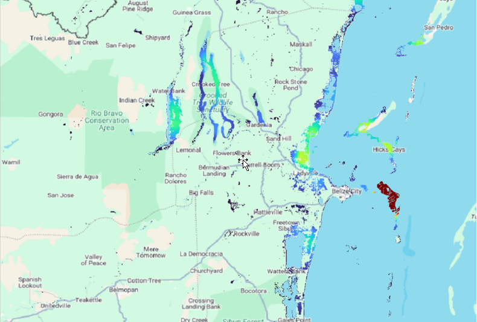
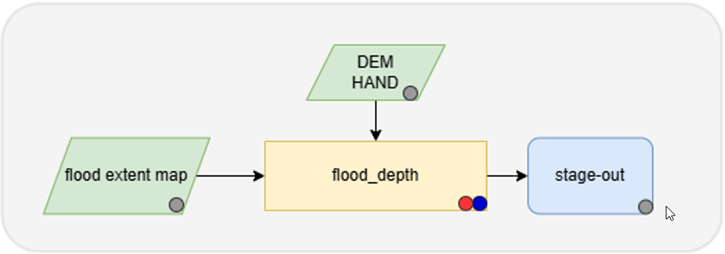

ES - Detalles del mapeo de la profundidad de las inundaciones (Flood Depth Mapping)
====================================================================================

La herramienta Flood Depth Mapping (FlDM) permite a los usuarios crear mapas completos de profundidad de inundaciones para áreas y periodos de tiempo determinados. 
El sistema extrae de forma autónoma la profundidad del agua en regiones urbanas y rurales. 
Para ello, utiliza un mapa de inundaciones y un modelo digital de elevación o un HAND alternativo, según cuál sea superior en términos de calidad.
En cuanto a los productos geográficos, el servicio FlDM genera bajo demanda mapas de profundidad de las aguas de inundación en decímetros.

El algoritmo para estimar la profundidad del agua en una llanura aluvial se basa en el método propuesto por Matgen et al. (2016) [1]_. 

Este enfoque combina datos sobre la extensión de las inundaciones obtenidos mediante observación de la Tierra con mapas de altura sobre el drenaje más cercano (HAND) derivados de la topografía. 
Se parte del supuesto de un flujo uniforme, lo que significa que la profundidad del agua en relación con la red de drenaje se mantiene constante en toda una sección determinada de la llanura aluvial. 
Los datos HAND, que normalizan la topografía con respecto a la red de drenaje, se someten a umbrales iterativos para generar una máscara binaria que se ajuste mejor al mapa de extensión de la inundación en el área de estudio. 
Una vez determinado el umbral óptimo a partir de la extensión de las aguas de inundación derivada de HAND, se puede estimar la profundidad del agua para cada punto clasificado como agua de inundación. 
Toda la AOI se divide en mosaicos más pequeños del mismo tamaño, de modo que se puedan ver los efectos locales del tamaño de la inundación y el terreno en cada uno de ellos. A continuación, se utiliza el umbral óptimo para estimar la profundidad del agua para todos los píxeles de cada mosaico más pequeño. 
Con el fin de eliminar los efectos fronterizos de los mosaicos cercanos, también se aplica un filtro de suavizado de paso bajo.

Este servicio es proporcionado por el Instituto de Ciencia y Tecnología de Luxemburgo (LIST).

.. figure:: ../_static/flood_depth/1_water_depth_Colombia.png
    :alt: water depth map of Colombia
    :align: center
    :figwidth: 80%
    :name: fig:water_depth_map_colombia_esp

    Ejemplo de mapa de profundidad del agua en Colombia

.. raw:: html

   

    Ejemplo de mapa de profundidad del agua en Belice

Flujo de trabajo
-----------------------------------------

El siguiente esquema describe el flujo de trabajo de alto nivel del servicio FlDM. 

    Flujo de trabajo del servicio FlDM

El flujo de trabajo requiere como entrada el mapa de extensión de la inundación (proporcionado por el usuario o eventualmente producido con el servicio de cartografía de extensión de inundaciones) y el DEM/HAND.
A continuación, el servicio calcula automáticamente la profundidad del agua basándose en los mapas de extensión de la inundación y el DEM derivado sobre el AOI. 

A continuación se detallan cada uno de los pasos de la cadena descritos en el flujo de trabajo de FlDM.

Flood_extent map
^^^^^^^^^^^^^^^^^

El servicio espera como entrada un mapa de extensión de inundaciones, que puede ser representativo de un área urbana o de escasa vegetación basado en un solo evento o en la extensión máxima estacional o anual. 

Flood_depth
^^^^^^^^^^^^^^^^^

El servicio utiliza los mapas de extensión para calcular la profundidad del agua en toda la llanura aluvial.
Para ello, se supone un flujo uniforme (es decir, se considera que la profundidad del flujo con respecto a la red de drenaje es la misma en todas las secciones de la llanura aluvial).
En otras palabras, se espera que la profundidad del agua por encima del drenaje más cercano sea constante para un tramo determinado del río.
Para determinar este valor, se debe generar la trama de altura sobre el drenaje más cercano (HAND) utilizando el DEM del área de interés como topografía de origen y un archivo de forma de la red fluvial.
El modelo HAND normaliza la topografía con respecto a la red de drenaje.

A continuación, se establece un umbral para la trama HAND con el fin de generar una máscara binaria que se ajuste de manera óptima, en toda la región de estudio, al mapa de extensión de la inundación obtenido a partir de datos SAR o de teledetección óptica.
Se pueden utilizar diferentes medidas de rendimiento para calibrar el parámetro de umbral.
Se utiliza el índice crítico de éxito (CSI), que combina la tasa de aciertos y la tasa de falsas alarmas en una sola puntuación como medio para evaluar la proximidad de los dos mapas de extensión de la inundación.
El valor umbral óptimo corresponde a la altura de la línea de agua por encima del drenaje más cercano, denominada :math:`HAND_{WATER}`, y se considera constante para un tramo determinado.

Una vez optimizado el parámetro :math:`HAND_{WATER}` , se puede generar un mapa de profundidad del agua, de la siguiente manera::

:math:`h_{x,y}` = :math:`HAND_{WATER}` - :math:`HAND_{x,y}`

donde :math:`h_{x,y}` es la altura del agua en la ubicación con coordenadas x, y mientras que :math:`HAND_{x,y}` es el valor de la trama HAND en la misma ubicación.

Input
-----------------------------------------

El servicio FlDM requiere la siguiente información:

* Mapa histórico de extensión de inundaciones: mapa de delimitación de inundaciones del evento que se va a analizar. Se puede generar con el servicio de cartografía de extensión de inundaciones o puede proporcionarlo el usuario.
* Copernicus DEM GLO-30: Modelo digital de elevación o HAND. 

Parámetros
-----------------------------------------

El servicio FlDM requiere un número específico de parámetros obligatorios. En la tabla siguiente se describen estos parámetros. 

.. list-table::
   :widths: 20 60 20
   :header-rows: 1

   * - Parámetro
     - Descripción
     - Obligatorio
   * - Área de interés
     - Área de interés que se tratará en el servicio
     - SÍ
   * - Tamaño de los subtítulos
     - El tamaño de los subtítulos donde optimizar los parámetros de estimación de la profundidad del agua.
     - SÍ
    
Bibliografía
-----------------------------------------

.. [1] P. Matgen, L. Giustarini, M. Chini, R. Hostache, M. Wood and S. Schlaffer, "Creating a water depth map from SAR flood extent and topography data," 2016 IEEE International Geoscience and Remote Sensing Symposium (IGARSS), Beijing, China, 2016, pp. 7635-7638, doi: 10.1109/IGARSS.2016.7730991.