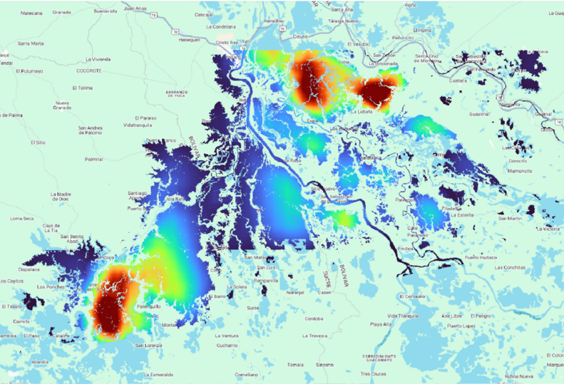

Flood Depth Mapping Details
=========================================

Service Description
-----------------------------------------

The Flood Depth Estimation (FDE) tool enables users to create comprehensive flood depth maps for designated areas and timeframes. 
The system autonomously extracts water depth in urban and rural regions. 
It accomplishes this by utilizing a floodwater map and either a Digital Elevation Model or an alternative HAND, according on which is superior in terms of quality.
In terms of geophysical products, the FDE service generates on demand flood water depth maps in decimetres.

The algorithm for estimating water depth across a floodplain is based on the method proposed by Matgen et al. (2016) [1]_. 

This approach combines EO-derived flood extent data with topography-derived Height Above Nearest Drainage (HAND) maps. 
It assumes uniform flow, meaning the water depth relative to the drainage network remains consistent across a given floodplain section. 
The HAND data, which normalizes topography with respect to the drainage network, is iteratively thresholded to generate a binary mask that best aligns with the flood extent map in the study area. 
Once the optimal threshold from the HAND-derived floodwater extent is determined, water depth can be estimated for each point classified as floodwater. 
The whole AOI is split into smaller tiles of the same size so that the local effects of flood size and terrain can be seen in each one. Then the optimal threshold is used to estimate the water depth for all pixels in each smaller tile. 
In order to remove border effects of close tiles, a smoothing low-pass filter is also applied.

    Example of water depth map in Colombia

.. raw:: html

   

.. figure:: ../_static/flood_depth_mapping/2_water_depth_Belize.png
    :alt: water depth map of Belize
    :align: center
    :figwidth: 80%
    :name: fig:water_depth_map_belize

    Example of water depth map in Belize

Worflow
-----------------------------------------

The schema below describes the high-level workflow of the FDE service. 

.. figure:: ../_static/flood_depth_mapping/3_workflow.png
    :alt: workflow of the FDE service
    :align: center
    :figwidth: 80%
    :name: fig:workflow_fde

    Workflow of the FDE service

The workflow requires as input the flood extent map (provided by the user or eventually produced with the flood extent mapping service), and the DEM/HAND.
After that, the service automatically calculates water depth based on the flood extent maps and the DEM derived over the AOI. 

Below are given details of each step of the chain described in the FDE workflow.

Flood_extent map
^^^^^^^^^^^^^^^^^

The service is expecting as input a flood extent map, which can be representative of an urban or sparsely vegetated area based 
on a single event or the seasonal or annual maximum extent. 

Flood_depth
^^^^^^^^^^^^^^^^^

The service uses the extent maps to compute water depth across the floodplain.
For this, uniform flow is assumed (that is, the depth of flow with respect to the drainage network is considered to be the same at every section of the floodplain).
In other words, the depth of water above the nearest drainage is expected to be constant for a given river reach.
To determine this value, the Height Above Nearest Drainage (HAND) raster using the area of interest's DEM as source topography and a shapefile of the river network, must be generated.
The HAND model normalizes the topography with respect to the drainage network.

Next, the HAND raster is thresholded in order to generate a binary mask that optimally fits, over the entire region of study, the flood extent map obtained from SAR or Optical remote sensing data.
Different performance measures can be used for calibrating the threshold parameter.
The Critical Success Index (CSI) is used, combining Hit Rate and False Alarm Ratio into one score as a means of evaluating the closeness of the two flood extent maps.
The optimal threshold value corresponds to the height of the water line above the nearest drainage, termed :math:`HAND_{WATER}`, and is considered constant for a given subreach.

Once the :math:`HAND_{WATER}` parameter has been optimized, a water depth map can be generated, as follows:

:math:`h_{x,y}` = :math:`HAND_{WATER}` - :math:`HAND_{x,y}`

where :math:`h_{x,y}` is the water height at the location with coordinates x, y and :math:`HAND_{x,y}` is the value of the HAND raster at the same location.

Input
-----------------------------------------

The FDE service requires in input:

* Historical flood extent map: Flood delineation map of the event to be analyzed. It can be produced with the flood extent mapping service or provided by the user.
* Copernicus DEM GLO-30: Digital Elevation Model or HAND. 

Parameters
-----------------------------------------

The FDE service requires a specified number of mandatory parameters. The table below describes these parameters. 

.. list-table::
   :widths: 20 60 20
   :header-rows: 1

   * - Parameter
     - Description
     - Required
   * - Area of interest
     - Area of interest to be covered by the service
     - YES
   * - Size of subtiles
     - The size of the subtile where to optimize the water depth estimation parameters.
     - YES
    

.. [1] P. Matgen, L. Giustarini, M. Chini, R. Hostache, M. Wood and S. Schlaffer, "Creating a water depth map from SAR flood extent and topography data," 2016 IEEE International Geoscience and Remote Sensing Symposium (IGARSS), Beijing, China, 2016, pp. 7635-7638, doi: 10.1109/IGARSS.2016.7730991.