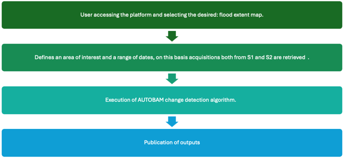
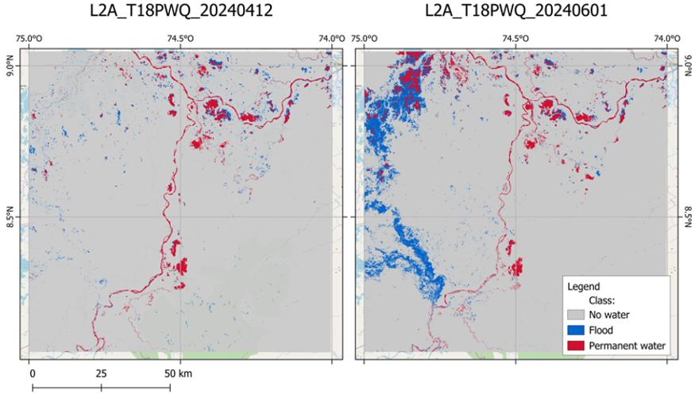
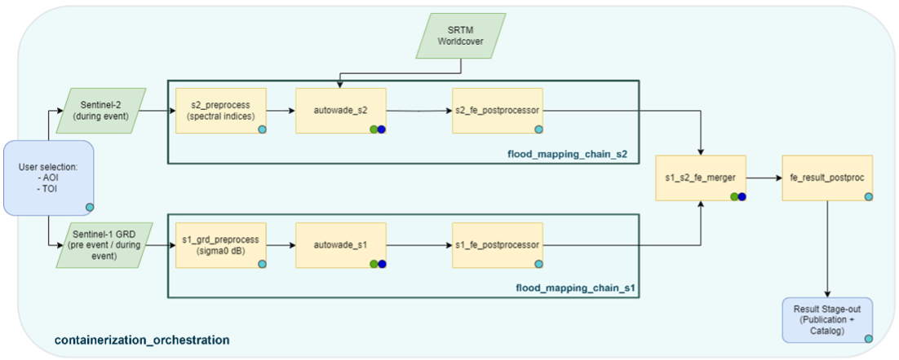
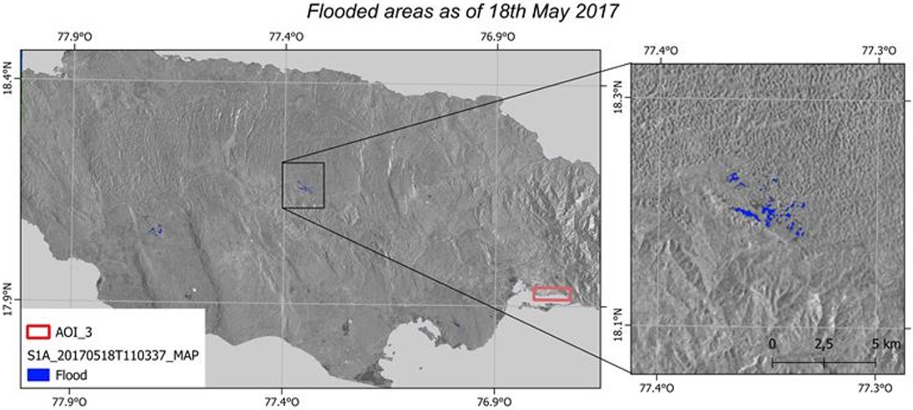

Flood Event Detection Details
=========================================

The Flood Event Detection (FED) service focuses on single-event flood detection from SAR and Optical satellite data. 
Products are flood delineation maps for specific flood events with maximum extent derived from the combination of Sentinel-1 and Sentinel-2 imagery.

In terms of geophysical products, the FED service generates on demand a flood extent map of a single flooding event

    Scheme about Flood Event Detection service workflow

.. raw:: html

   

This service exploits two processing chains.
The first one uses Optical data and focuses on the flooded areas detection starting from a single S2 image.
The algorithm uses a S2 image acquired after the event covering the area of interest.
The algorithm also uses as input an extract of the ESA Land Use / Land Cover map and a Water Bodies Mask that are used to improve the quality of the flood extent detection.
The second chain uses SAR data and focuses on flooded area detection starting from a couple of Sentinel 1 images.
The algorithm uses a S1 Image after the flood event and a S1 Image before the event.
The two images must share the same relative orbit and cover the same area. 
The algorithm also uses as input an extract of the ESA Land Use / Land Cover map that is used to improve the quality of the flood extent detection.
The service then merges the two maps into a unique one representing the maximum flood extension detected both from optical and Radar data sources.
The output is a boolean map representing flooded (1) and not flooded (0) pixels.

    Example of S2-derived flood extent maps for two dates in la Mojana, Colombia (12/04 and 01/06, 2024). 

.. raw:: html

   

Worflow
-----------------------------------------

The schema shown in this section describes the high-level workflow of the FED service. 

    Workflow of the FED service.

.. raw:: html

   

Below are given details of each step of the chain described in the FED workflow.

User selection
^^^^^^^^^^^^^^^^^^^^^^^^^^^^^^^^^^

Platform component where users configure parameters for service execution 

s1_grd_preprocess and s2_preprocess
^^^^^^^^^^^^^^^^^^^^^^^^^^^^^^^^^^^^^^

Standard preprocessing modules to obtain Sentinel-1 calibrated, corrected and projected sigma nought intensity images in dBs, and Sentinel-2 L2A (BOA) cloud-screened radiances. 

autowade_s1 and autowade_s2
^^^^^^^^^^^^^^^^^^^^^^^^^^^^^^^^^^

CIMA’s algorithms for change detection (Sentinel-1) and flood detection (Sentinel-2), which execute over all Sentinel tiles fitting into the AOI. 

s1_fe_postprocessor and s2_fe_postprocessor
^^^^^^^^^^^^^^^^^^^^^^^^^^^^^^^^^^^^^^^^^^^^^^^^^^^^

Modules for image processing to solve noise, border effects and more issues potentially affecting the final result.

s1_s2_fe_merger
^^^^^^^^^^^^^^^^^^^^^^^^^^^^^^^^^^

Algorithm to merge the flood extents obtained separately from Sentinel-1 and Sentinel-2 as long as a set of conditions are met (e.g. a maximum length of time gap of respective captures). 

fe_result_postproc
^^^^^^^^^^^^^^^^^^^^^^^^^^^^^^^^^^

Module for image processing of the final flood extent result. 

Stage-out
^^^^^^^^^^^^^^^^^^^^^^^^^^^^^^^^^^

End points of the service to store and visualize the results.

    Example of S1-derived flood extent map in Jamaica, 18th May 2017

.. raw:: html

   

Input
-----------------------------------------

The following inputs are needed to run the service: 

**Sentinel imagery**

* Sentinel-2 L2A: one tile or more tiles overlapping the Area of Interest (AOI), captured during or shortly after the flooding event.
* Sentinel-1 GRD: two sets of tiles (or group of tiles) overlapping the AOI, captured before and after the event.

**Ancillary data: to be used in the AUTOWADEs algorithms**

* Copernicus DEM GLO-30: Digital Elevation Model from Copernicus [1]_
* Worldcover: land use/ land cover from ESA [2]_

Parameters
-----------------------------------------

The following parameters are needed to run the service:

* Area of Interest (AOI): the geographical region to be analyzed 
* Time of Interest (TOI): The time range around the event to be analyzed, to select the images over the AOI.

Output
-----------------------------------------

The service will produce the following outputs:

Flood extent map of a single flooding event.

* *Definition*: flood extent in binary values:  1 - flooded; 0 - non flooded
* *Data type*: Geospatial layers 
* *Format*: raster file
* *Spatial resolution*: 20m.
* *Frequency*: obtained on demand
* *Spatial coverage*: The service is available for the whole LAC region.
* *Temporal coverage*: depending on the combine revisit time of Sentinel-1 and Sentinel-2 satellites 
* *Constraints*: availability of EO acquisitions.

References
-----------------------------------------

.. [1] Copernicus DEM - Global Digital Elevation Model - COP-DEM_GLO-30 https://doi.org/10.5270/ESA-c5d3d65
.. [2] WorldCover 2021 v200 - Zanaga, D., Van De Kerchove, R., Daems, D., De Keersmaecker, W., Brockmann, C., Kirches, G., Wevers, J., Cartus, O., Santoro, M., Fritz, S., Lesiv, M., Herold, M., Tsendbazar, N.E., Xu, P., Ramoino, F., Arino, O., 2022. ESA WorldCover 10 m 2021 v200. https://doi.org/10.5281/zenodo.7254221
