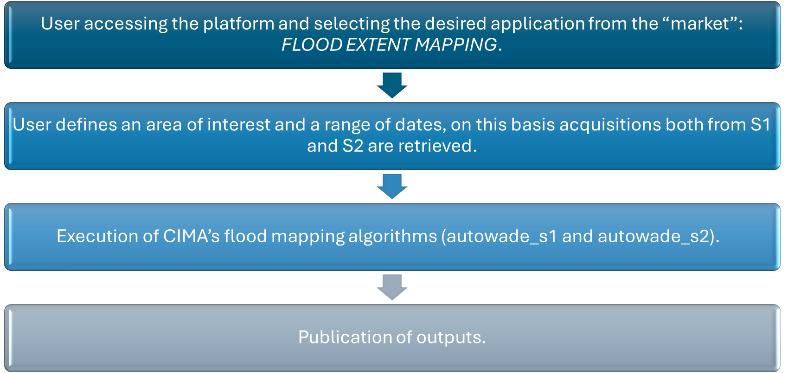
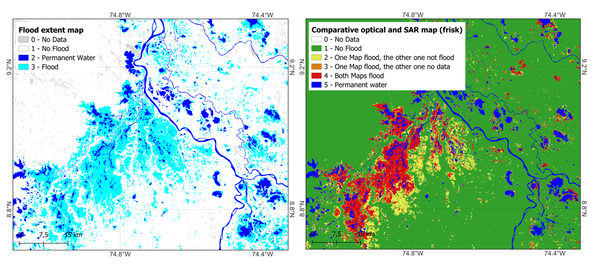
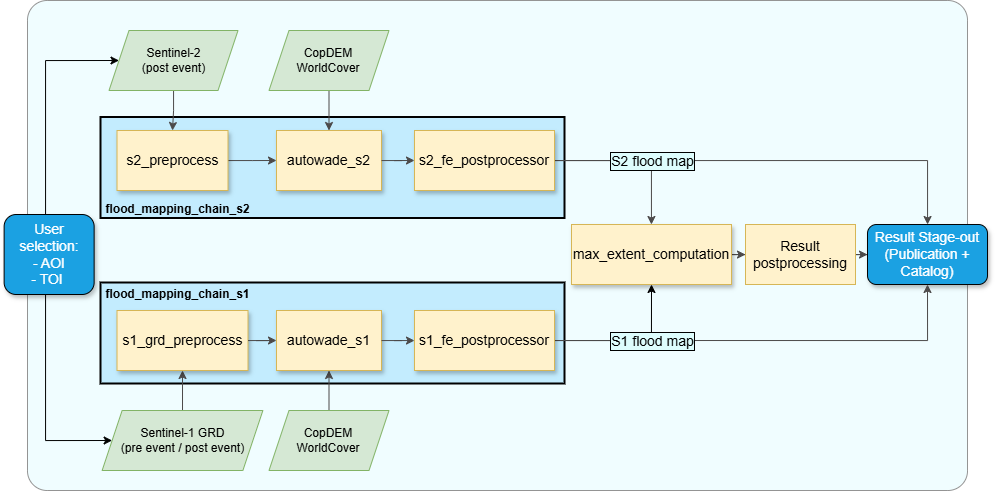

Flood Extent Mapping Details
=========================================

The Flood Extent Mapping (FEM) service focuses on single-event flood detection from Synthetic Aperture Radar (SAR) and optical satellite data. 
Products are flood delineation maps for specific flood events with maximum extent derived from the combination of Sentinel-1 (S1) and Sentinel-2 (S2) imagery.

In terms of geophysical products, the FEM service generates on demand a flood extent map of a single flooding event

    Scheme about Flood Extent Mapping service workflow

.. raw:: html

   

This service is based on two processing chains that exploit the AUTOWADE (AUTOmatic Water Areas Detector) algorithm, developed by CIMA Research Foundation.
The first chain uses optical data to detect flooded areas based on a single Sentinel-2 (S2) image acquired after the flood event (autowade_s2) [1]_.
The second chain uses Synthetic Aperture Radar (SAR) data, analysing a pair of Sentinel-1 (S1) images: one acquired before and one after the flood event (autowade_s1) [2]_. 
These images must share the same relative orbit and cover the same geographic area.
Both chains also use the Copernicus DEM [3]_ and ESA global land cover [4]_ products as ancillary data to improve the accuracy of flood extent detection. 
Each flood detection algorithm produces a classified map with four states: masked (0), not flooded (1), permanent water (2), and flooded (3) pixels.
If multiple maps are produced within the defined temporal window, these are then combined, as first by sensors, to generate a maximum extent map (S1 max extent and S2 max extent maps) representing the union of all flooded areas detected across the available scenes.
When flood maps are successfully generated from both S1 and S2 data (i.e., optical data is available and not affected by cloud coverage), the service merges the two outputs into a single map representing the maximum flood extent detected by either source. 
In this case, a comparative map is also generated to highlight areas of agreement and difference between SAR- and optical-derived flood maps. This map uses the following legend: no data (0); no flood (1); one map flood, the other one not flood (2); one map flood, the other one no data (3), both maps flood (4); permanent water (5).

This service is provided by CIMA Research Foundation.

    Example of output products of the FEM service over Mojana (Colombia): on the left Flood Extent Map derived from Sentinel-1 data, on the right Comparative (SAR and optical) map. 

.. raw:: html

   

Worflow
-----------------------------------------

The schema shown in this section describes the high-level workflow of the FEM service. 

    Workflow of the FEM service.

.. raw:: html

   

Below are given details of each step of the chain described in the FEM workflow.

**User selection**

Platform component where users configure parameters for service execution 

**s1_grd_preprocess**

Standard preprocessing workflow to obtain Sentinel-1 calibrated, corrected and projected sigma nought intensity images in dBs using as input Sentinel-1 GRD products. The preprocessing module includes the pairing of pre and post images per orbit to be ingested by the autowade_s1 algorithm. 

**s2_preprocess**

Sentinel-2 MSI L2A data preparation and spectral index computation. Preprocessing includes cloud and shadow masking by means of the S2 Scene CLassification (SCL) map, followed by the Modified Normalize Difference Water Index (MNDWI) generation [5]_. MNDWI, delivered at 20 m resolution, is extracted and given as input for following steps of the workflow.

**autowade_s1** 

Execution of autowade_s1 involves detecting flooded and permanent water areas from Sentinel-1 data using a change detection approach between pre- and post-event images acquired over the same orbit [2]_.
First, the method excludes steep and urban areas, by means of ancillary data [3]_ [4]_. Permanent water bodies are identified using a Buffer-from-Edge approach. In this process, an unsupervised clustering algorithm is applied to the co-polarized VV image to segment groups of similar pixels. The class with the lowest median is assumed to represent water pixels.
The derived Continuous Dynamic Water Area (CDWA) is then compared with the reference permanent water layer from WorldCover. The intersection between both datasets undergoes edge detection, followed by a buffering operation to obtain a bimodal distribution of water and non-water pixels. Once this distribution is achieved, an automatic thresholding method is applied.
To refine the classification of permanent water, a region-growing approach is employed to ensure all neighbouring water pixels are included. The same strategy is used to classify floodwater, but in this case, the method is applied to the difference between post and pre-event acquisitions.

**autowade_s2**

Execution of autowade_s2 involves detecting flooded and permanent water areas from Sentinel-2 single post event image. 
Certain areas of the pre-processed MNDWI data are excluded from the analysis, i.e. urban areas (from ESA WorldCover). Water detection follows the “Buffer-from-Cluster Approach,” as described by Pulvirenti et al. (2020) [1]_. An unsupervised clustering algorithm is applied to the spectral index to group similar pixels within the scene, assuming that the class with the highest median represents water pixels.
The resulting Clustering-Derived Water Area (CDWA) undergoes edge detection, followed by a buffer operation to generate a bimodal distribution of water and non-water pixels. Once this distribution is established, an automatic thresholding method is applied.
To refine the water classification, a region-growing approach is used to ensure all neighboring water pixels are included. Finally, by intersecting the water delineation map with the reference water layer (derived from ESA WorldCover), permanent water is identified (pixels classified as water in both WorldCover and the S2-derived map), while flooded water is distinguished (pixels classified as water only in the Sentinel-2-derived map).

**s1_fe_postprocessor** and **s2_fe_postprocessor**

Modules for image processing to solve noise, border effects and more issues potentially affecting the final result.

**max_extent_computation**

Algorithm to merge the flood extents obtained separately from Sentinel-1 and Sentinel-2, produce maximum flood extent maps and the comparative one.

**fe_result_postproc**

Module for image processing of the final flood extent results. 

**Stage-out**

End points of the service to store and visualize the results.

.. figure:: ../_static/flood_event/4_example_jamaica.png
    :alt: Flood Extent Mapping example in Jamaica
    :align: center
    :figwidth: 80%
    :name: fig:example_flood_event_jamaica

    Example of S1-derived flood extent map for the Mojana region (Colombia) as of 31st May 2024

.. raw:: html

   

Input
-----------------------------------------

The following inputs are needed to run the service: 

**Sentinel imagery**

* Sentinel-2 L2A: one tile or more tiles overlapping the Area of Interest (AOI), captured during or shortly after the flooding event.
* Sentinel-1 GRD: two sets of tiles (or group of tiles) overlapping the AOI, captured before and after the event in the same relative orbit.

**Ancillary data: to be used in the AUTOWADEs algorithms**

* Copernicus DEM GLO-30: Digital Elevation Model from Copernicus [3]_
* Worldcover: land cover from ESA [4]_

Parameters
-----------------------------------------

The following parameters are needed to run the service:

* Area of Interest (AOI): The geographical region to be analyzed. 
* Time of Interest (TOI): The time range around the event to be analyzed, to select the images over the AOI.

Output
-----------------------------------------

The service will produce the following outputs:

Flood extent map of a single flooding event.

* *Definition*: flood extent map: 0 - masked pixels; 1 - no flood; 2 - permanent water; 3 - flooded.
* *Data type and format*: UInt8, GeoTIFF.  
* *Spatial resolution*: 20m.
* *Frequency*: obtained on demand.
* *Spatial coverage*: The service is available for the whole LAC region.
* *Temporal coverage*: depending on the combine revisit time of Sentinel-1 and Sentinel-2 satellites. 
* *Constraints*: limited by the availability of suitable Earth Observation acquisitions; urban areas and steep terrain are excluded from the analysis.

Comparative optical and SAR flood map

* *Definition*: comparative map that highlights areas of agreement and difference between SAR- and optical-derived flood maps. Legend: 0 - No Data; 1 - No flood; 2 - One map flood, the other one not flood; 3 - One map flood, the other one no data; 4 - Both maps flood; 5 - Permanent water.
* *Data type and format*: UInt8, GeoTIFF.
* *Spatial resolution*: 20m.
* *Frequency*: obtained on demand.
* *Spatial coverage*: The service is available for the whole LAC region.
* *Temporal coverage*: depending on the combine revisit time of Sentinel-1 and Sentinel-2 satellites.
* *Constraints*: limited by the availability of suitable Earth Observation acquisitions.

References
-----------------------------------------

.. [1] Pulvirenti, L., Squicciarino, G., Fiori, E. (2020). A Method to Automatically Detect Changes in Multitemporal Spectral Indices: Application to Natural Disaster Damage Assessment. Remote Sensing, 12(17), 2681. https://doi.org/10.3390/rs12172681
.. [2] Pulvirenti, L., Squicciarino, G., Fiori, E., Ferraris, L., & Puca, S. (2021). A Tool for Pre-Operational Daily Mapping of Floods and Permanent Water Using Sentinel-1 Data. Remote Sensing, 13(7), 1342. https://doi.org/10.3390/rs13071342
.. [3] Copernicus DEM - Global Digital Elevation Model - COP-DEM_GLO-30 https://doi.org/10.5270/ESA-c5d3d65
.. [4] WorldCover 2021 v200 - Zanaga, D., Van De Kerchove, R., Daems, D., De Keersmaecker, W., Brockmann, C., Kirches, G., Wevers, J., Cartus, O., Santoro, M., Fritz, S., Lesiv, M., Herold, M., Tsendbazar, N.E., Xu, P., Ramoino, F., Arino, O., 2022. ESA WorldCover 10 m 2021 v200. https://doi.org/10.5281/zenodo.7254221
.. [5] Xu, H. (2006). Modification of normalised difference water index (NDWI) to enhance open water features in remotely sensed imagery. International Journal of Remote Sensing, 27(14), 3025–3033. https://doi.org/10.1080/01431160600589179
