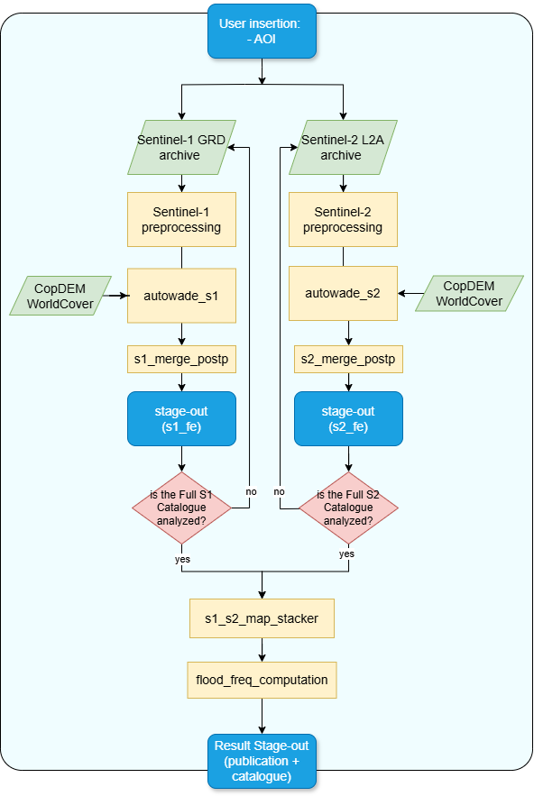

ES - Detalles del servicio de mapeamento de frecuencia de inundaciones (Flood Frequency Mapping)
==============================================================================================

El servicio Flood Frequency Mapping (FFM) utiliza mapas multitemporales de la extensión de las inundaciones para generar un mapa de frecuencia de inundaciones que ilustra los patrones de ocurrencia de las mismas.
El servicio se basa en mapas de inundaciones derivados de datos ópticos y SAR que se analizan sistemáticamente en todo el archivo Sentinel-2 (L2A) y Sentinel-1 (GRD) desde 2015 hasta 2024, con actualizaciones periódicas. 
El servicio funciona independientemente de las activaciones de los usuarios, generando mapas actualizados de la extensión de las inundaciones utilizando datos de Sentinel-1 y Sentinel-2 y un algoritmo automatizado de detección de cambios.
Con el tiempo, se analiza el conjunto completo de estos mapas de extensión de las inundaciones para producir un mapa completo de la frecuencia de las inundaciones que muestra la recurrencia de las inundaciones en toda la AOI.

El servicio FFM genera un mapa de frecuencia de inundaciones, en el que se indica la proporción de tiempo durante la cual un píxel determinado ha estado inundado.

Los datos de observación de la Tierra (EO) de las colecciones Sentinel-2 L2A y Sentinel-1 GRD se ingestan y calibran de forma automatizada para el catálogo completo de 2015-2024. 
Para cada dato de Sentinel-2 y Sentinel-1, el servicio FFM genera automáticamente mapas de delimitación de agua utilizando los algoritmos autowade_s2 y autowade_s1 del CIMA. 
El servicio toma la pila completa de mapas de inundaciones derivados de Sentinel-1 y Sentinel-2 para calcular la frecuencia de las inundaciones, donde cada píxel tiene un valor entre 0 y 100 %, lo que indica cuántas veces se inundó del número total de veces que se observó (véase la figura siguiente como ejemplo).

El servicio FFM tiene una ejecución inicial para calcular la frecuencia de inundaciones del archivo completo de 2015-2024.
Posteriormente, el mapa de frecuencia de inundaciones se actualiza cada seis meses, incorporando todas las nuevas adquisiciones de Sentinel-1 y Sentinel-2 en el análisis.

Este servicio es brindado por la CIMA Research Foundation y WASDI SARL.

.. figure:: ../_static/flood_frequency/1_flood_frequency_product.png
    :alt: Flood Frequency Map
    :align: center
    :figwidth: 80%
    :name: fig:flood_frequency_product_esp

    Ejemplo de producto de frecuencia de inundaciones obtenido para el período 2015-2024 sobre Mojana (Colombia). Créditos: CIMA.

.. raw:: html

   

Flujo de trabajo
-----------------------------------------

El esquema de esta sección describe el flujo de trabajo de alto nivel del servicio FFM.

El flujo de trabajo solo requiere como entrada un área de interés (AOI) (por ejemplo, una parte del territorio colombiano) donde realizar el análisis.

A continuación, el servicio inicia la cartografía automática de inundaciones en el catálogo completo de imágenes disponibles de las misiones Sentinel-1 y Sentinel-2, con el apoyo de datos auxiliares como CopDEM [1]_ y WorldCover de la ESA [2]_.
Los mapas de inundaciones derivados de Sentinel-1 y Sentinel-2 se introducen a continuación en las respectivas herramientas de cálculo de la frecuencia de inundaciones.
Los mapas de frecuencia de inundaciones derivados de las cadenas de procesamiento de Sentinel-1 y Sentinel-2 por separado se fusionan finalmente en un único producto final.

    Flujo de trabajo del servicio FFM

A continuación se detallan cada uno de los pasos de la cadena descritos en el flujo de trabajo FFM.

**Sentinel-1 GRD preprocessing**

Este módulo incluye un flujo de trabajo de preprocesamiento estándar para obtener imágenes de intensidad sigma cero calibradas, corregidas y proyectadas de Sentinel-1 en dB utilizando como entrada productos GRD de Sentinel-1.
El módulo de preprocesamiento incluye el emparejamiento de imágenes previas y posteriores por órbita que serán procesadas por el algoritmo autowade_s1.

**Sentinel-2 L2A preprocessing**

Esta parte de la cadena se dedica a la preparación de datos Sentinel-2 MSI L2A y al cálculo del índice espectral. 
El preprocesamiento incluye el enmascaramiento de nubes y sombras mediante el mapa S2 Scene CLassification (SCL), seguido de la generación del índice de agua normalizado modificado (MNDWI) [3]_. El MNDWI, con una resolución de 20 m, se extrae y se utiliza como entrada para los siguientes pasos del flujo de trabajo.

**autowade_s1**

El algoritmo AUTOWADE (AUTOmatic Water Areas Detector), desarrollado por CIMA, está diseñado para procesar datos Sentinel-1 (autowade_s1) [4]_.
La metodología tiene como objetivo producir mapas que delimiten tanto la extensión de las aguas permanentes como la de las inundaciones utilizando un enfoque de detección de cambios entre imágenes previas y posteriores al evento adquiridas en la misma geometría orbital.
En primer lugar, se excluyen del análisis determinadas zonas de la imagen GRD de Sentinel-1 preprocesada, incluidas las regiones escarpadas (basadas en los datos de pendiente Cop-DEM) y las zonas urbanas (basadas en WorldCover).
Las masas de agua permanentes se identifican utilizando un enfoque de «buffer desde el borde».
En este proceso, se aplica un algoritmo de agrupamiento no supervisado a la imagen VV copolarizada para segmentar grupos de píxeles similares.
Se supone que la clase con la mediana más baja representa los píxeles de agua.
A continuación, se compara el área de agua dinámica continua (CDWA) derivada con la capa de agua permanente de referencia de WorldCover.
La intersección entre ambos conjuntos de datos se somete a una detección de bordes, seguida de una operación de amortiguación para obtener una distribución bimodal de píxeles de agua y no agua.
Una vez lograda esta distribución, se aplica un método de umbral automático.
Para refinar la clasificación del agua permanente, se emplea un enfoque de crecimiento regional para garantizar que se incluyan todos los píxeles de agua vecinos.
Se utiliza la misma estrategia para clasificar el agua de inundación, pero en este caso, el método se aplica a la diferencia entre las adquisiciones posteriores al evento y la imagen más reciente anterior al evento de la misma geometría orbital.

**autowade_s2**

El algoritmo AUTOWADE (AUTOmatic Water Areas Detector), desarrollado por CIMA, está diseñado para procesar datos Sentinel-2 (autowade_s2) [4]_.
La metodología tiene como objetivo producir mapas que delimiten tanto la extensión permanente como la de las aguas de inundación.
Ciertas áreas de los datos MNDWI preprocesados se excluyen del análisis, incluidas las regiones escarpadas (basadas en los datos de pendiente Cop-DEM) y las áreas urbanas (de ESA WorldCover).
La detección de agua sigue el «enfoque de búfer a partir de clústeres», tal y como lo describen Pulvirenti et al. (2020) [5]_.
Se aplica un algoritmo de agrupamiento no supervisado al índice espectral para agrupar píxeles similares dentro de la escena, suponiendo que la clase con la mediana más alta representa píxeles de agua.
El área de agua derivada de la agrupación (CDWA) resultante se somete a una detección de bordes, seguida de una operación de amortiguación para generar una distribución bimodal de píxeles de agua y no agua.
Una vez establecida esta distribución, se aplica un método de umbral automático.
Para refinar la clasificación del agua, se utiliza un enfoque de crecimiento regional para garantizar que se incluyan todos los píxeles de agua vecinos.
Por último, al intersectar el mapa de delineación del agua con la capa de agua de referencia (derivada de ESA WorldCover), 
se identifica el agua permanente (píxeles clasificados como agua tanto en WorldCover como en el mapa derivado de Sentinel-2), 
mientras que se distingue el agua inundada (píxeles clasificados como agua solo en el mapa derivado de Sentinel-2).

**s1_merge_postpr**

Este paso procesa el resultado de autowade_s1 para eliminar el ruido, los efectos de borde y otros problemas que pueden afectar al resultado final.
Si el AOI dado se cruza con varios mosaicos S1, el procesador crea un mosaico con los mapas de inundaciones de los diferentes mosaicos para generar un único mapa de inundaciones unificado.

**s2_merge_postp**

Este paso procesa el resultado de autowade_s2 para eliminar el ruido, los efectos de borde y otros problemas que pueden afectar al resultado final.
Si el AOI dado se cruza con varios mosaicos S2, el procesador incluye el mosaico de los mapas de inundaciones de diferentes mosaicos para obtener un único mapa de inundaciones.

**s1_s2_map stacker**

Este módulo realiza el registro conjunto y el remuestreo de toda la pila de mapas de extensión de inundaciones derivados de las imágenes de Sentinel-1 y Sentinel-2, con el fin de alinear todos los mapas de entrada a una cuadrícula espacial común.

**flood_frequency_computation**

Este procesador realiza un análisis basado en píxeles sobre una pila de mapas de extensión de inundaciones para generar un mapa de frecuencia de inundaciones. Para cada píxel, cuenta el número de veces que la superficie correspondiente se inundó en los mapas de inundaciones introducidos. A continuación, este recuento se normaliza por el número total de mapas utilizados en el cálculo, lo que da como resultado un valor de frecuencia expresado como porcentaje (0-100 %) para cada píxel.

Input
-----------------------------------------

El servicio FFM requiere los siguientes datos de entrada:

**Imágenes Sentinel**

* Datos GRD de Sentinel-1: todas las adquisiciones disponibles obtenidas sobre el AOI durante el período considerado.
* Datos Sentinel-2 MSI L2A: todas las adquisiciones disponibles obtenidas sobre el AOI dentro del período considerado, con una cobertura de nubes inferior al 70 %.

**Datos auxiliares: para su uso en los algoritmos AUTOWADEs**

* Copernicus DEM GLO-30: Modelo digital de elevación de la ESA [1]_
* WorldCover: cobertura del suelo de la ESA [2]_

Parámetros
-----------------------------------------

El servicio FFM requiere un número específico de parámetros obligatorios. La tabla siguiente describe estos parámetros.
Estos no son definidos por el usuario a través de la GUI, sino que pueden ser definidos por el operador del servicio dentro de un archivo de configuración antes de la activación del flujo de trabajo del servicio FFM.

.. list-table::
   :widths: 20 50 15 15
   :header-rows: 1

   * - Parámetro
     - Descripción
     - Obligatorio
     - Predeterminado
   * - Área de interés
     - Área de interés que cubrirá el servicio en WKT (por ejemplo, extensión de un distrito en Colombia)
     - SÍ
     -
   * - Cobertura máxima de nubes en las imágenes Sentinel-2
     - El porcentaje máximo de cobertura nubosa en las imágenes válidas previas al evento que se utilizarán.
     - NO
     - 70
   * - Tamaño del búfer
     - Tamaño del búfer que se implementará en el enfoque buffor-from-edge de autowade_s1, autowade_s2, expresado en número de píxeles
     - NO
     - 10
   * - MIN CLUST NUM
     - El número mínimo de clústeres para inicializar el algoritmo autowade_s1.
     - NO
     - 6

Output
-----------------------------------------

**Mapa de frecuencia de inundaciones**

* *Definición*: mapa de frecuencia de inundaciones, en el que cada píxel muestra cuántas veces se inundó en relación con el número total de veces que se observó, expresado en porcentaje. Rango válido [0-100 %].
* *Tipo y formato de datos*: UInt8, GeoTIFF.
* *Resolución espacial*: 20 m.
* *Frecuencia de las observaciones*: 5-12 días.
* *Frecuencia de actualización del producto*: seis meses.
* *Cobertura espacial*: dependiendo de la disponibilidad de recursos, el área de interés se seleccionará junto con el usuario final. El sistema es potencialmente extensible a toda la región de América Latina y el Caribe. 
* *Limitaciones*: disponibilidad de adquisiciones Sentinel-1 y Sentinel-2 de buena calidad; limitación zonal o hidrológica (por ejemplo, inundaciones repentinas).

Bibliografía
-----------------------------------------

.. [1] Copernicus DEM – Global Digital Elevation Model - COP-DEM_GLO-30 https://doi.org/10.5270/ESA-c5d3d65
.. [2] WorldCover 2021 v200 - Zanaga, D., Van De Kerchove, R., Daems, D., De Keersmaecker, W., Brockmann, C., Kirches, G., Wevers, J., Cartus, O., Santoro, M., Fritz, S., Lesiv, M., Herold, M., Tsendbazar, N.E., Xu, P., Ramoino, F., Arino, O., 2022. ESA WorldCover 10 m 2021 v200. https://doi.org/10.5281/zenodo.7254221
.. [3] Xu, H. (2006). “Modification of normalised difference water index (NDWI) to enhance open water features in remotely sensed imagery”. International Journal of Remote Sensing, 27(14), 3025–3033. https://doi.org/10.1080/01431160600589179
.. [4] Pulvirenti, L., Squicciarino, G., Fiori, E., Ferraris, L., & Puca, S. (2021). “A Tool for Pre-Operational Daily Mapping of Floods and Permanent Water Using Sentinel-1 Data”. Remote Sensing, 13(7), 1342. https://doi.org/10.3390/rs13071342
.. [5] Pulvirenti, L., Squicciarino, G., & Fiori, E. (2020). A Method to Automatically Detect Changes in Multitemporal Spectral Indices: Application to Natural Disaster Damage Assessment. Remote Sensing, 12(17), 2681. https://doi.org/10.3390/rs12172681