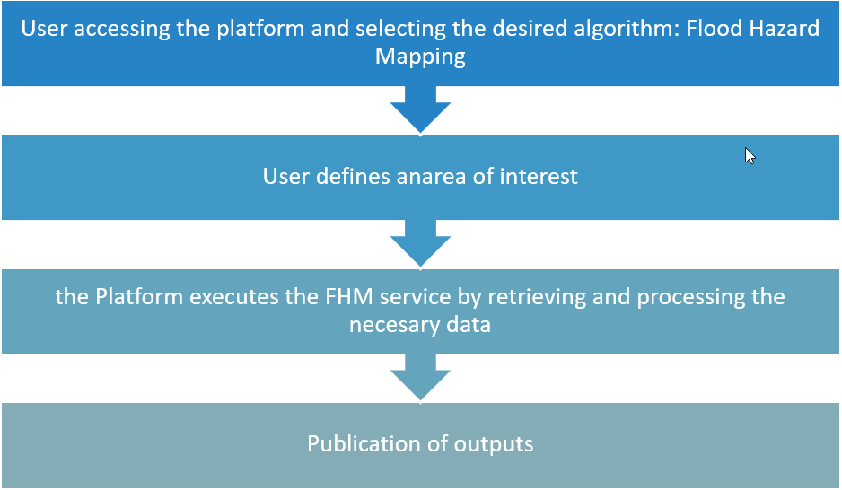

Flood Hazard Mapping Details
=========================================

The Flood Hzard mapping generates a set of enhanced flood hazard maps by merging modelled hazard maps from the GloFAS model and the empirical flood frequency map derived from the Flood Frequency Mapping service based only Sentinel-1. 
In terms of geophysical products, the FHM service generates a set of enhanced hazard maps for different return Periods/Frequencies. 

     Scheme about FHM service Standard Operating Procedure

.. raw:: html

   

The service produces a set of satellite-enhanced Hazard maps by comparing the flood frequency outputs from the Flood Frequency mapping service with the GloFAS flood Hazard maps, then adjusting the latter based on these insights.
In addition, ancillary computations are carried out to exclude non-floodable areas from the analysis, ensuring a more accurate and relevant final product, insensitive to satellite input resolution.
The user indicates the Workspace where the outputs of the Flood Frequency Mapping service are available.
The main benefits are expected for high frequency/low return periods maps as shown in the figure below.

.. figure:: ../_static/flood_hazard_mapping/2_map.png
    :alt: Flood Hazard Map
    :align: center
    :figwidth: 80%
    :name: fig:flood_hazard_map

     Example of a stack of flood hazard maps were the different return periods are layered one on the other maintaining the minimum return period in each pixel, the left panel shows the original set of map and the right panel shows the enhanced one (South Vietnam). 

.. raw:: html

   

Worflow
-----------------------------------------

The schema below describes the high-level workflow of the FHM service. 

.. figure:: ../_static/flood_frequency_mapping/3_workflow.png
    :alt: workflow of the FHM service
    :align: center
    :figwidth: 80%
    :name: fig:workflow_ffe

    Workflow of the FHM service

Below are given details of each step of the chain described in the FHM workflow.

^^^^^^^^^^^^^^^^^^^^^^^^^^^^^^^^^^

^^^^^^^^^^^^^^^^^^^^^^^^^^^^^^^^^^

^^^^^^^^^^^^^^^^^^^^^^^^^^^^^^^^^^

^^^^^^^^^^^^^^^^^^^^^^^^^^^^^^^^^^

^^^^^^^^^^^^^^^^^^^^^^^^^^^^^^^^^^

^^^^^^^^^^^^^^^^^^^^^^^^^^^^^^^^^^

^^^^^^^^^^^^^^^^^^^^^^^^^^^^^^^^^^

^^^^^^^^^^^^^^^^^^^^^^^^^^^^^^^^^^

^^^^^^^^^^^^^^^^^^^^^^^^^^^^^^^^^^

Input
-----------------------------------------

Parameters
-----------------------------------------

Output
-----------------------------------------

References
-----------------------------------------

.. [1] 
.. [2] 
.. [3] 
.. [4] 
.. [5] 