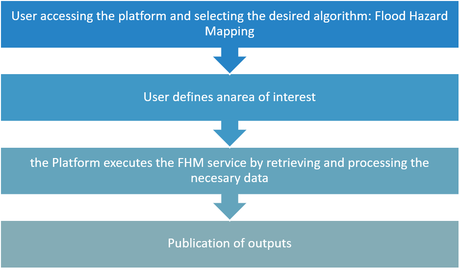
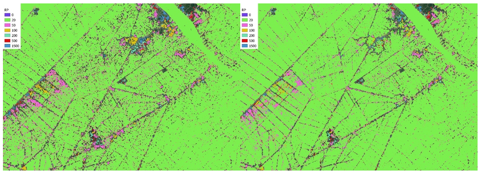

Flood Hazard Mapping Details
=========================================

The Flood Hazard Mapping (FHM) generates a set of enhanced flood hazard maps by merging modelled hazard maps from the GloFAS model and the empirical flood frequency map derived from the Flood Frequency Mapping service based only Sentinel-1. 
In terms of geophysical products, the FHM service generates a set of enhanced hazard maps for different return Periods/Frequencies. 

   
   Scheme about FHM service Standard Operating Procedure

.. raw:: html

   

The service produces a set of satellite-enhanced Hazard maps by comparing the flood frequency outputs from the Flood Frequency mapping service with the GloFAS flood Hazard maps, then adjusting the latter based on these insights.
In addition, ancillary computations are carried out to exclude non-floodable areas from the analysis, ensuring a more accurate and relevant final product, insensitive to satellite input resolution.
The user indicates the Workspace where the outputs of the Flood Frequency Mapping service are available.
The main benefits are expected for high frequency/low return periods maps as shown in the figure below.

   
   Example of a stack of flood hazard maps were the different return periods are layered one on the other maintaining the minimum return period in each pixel, the left panel shows the original set of map and the right panel shows the enhanced one (South Vietnam). 

This service is provided by CIMA Research Foundation and the Luxembourg Institute of Science and Technology (LIST).

Worflow
-----------------------------------------

The schema below describes the high-level workflow of the FHM service. 

.. figure:: ../_static/flood_hazard/3_workflow.png
    :alt: workflow of the FHM service
    :align: center
    :figwidth: 80%
    :name: fig:workflow_fhm

    Workflow of the FHM service

Below are given details of each step of the chain described in the FHM workflow.

User Insertion
^^^^^^^^^^^^^^^^^^^^^^^^^^^^^^^^^^

Platform component where users select the AOI for the FHM production.

s1_grd_preprocessor
^^^^^^^^^^^^^^^^^^^^^^^^^^^^^^^^^^

Standard preprocessing module to obtain Sentinel-1 calibrated, corrected and projected sigma nought intensity images in dBs. 

^^^^^^^^^^^^^^^^^^^^^^^^^^^^^^^^^^

Areas Excluder
^^^^^^^^^^^^^^^^^^^^^^^^^^^^^^^^^^

Standard preprocessing that excludes permanent waters form the hazard computation. 

Flood Frequency Chain
^^^^^^^^^^^^^^^^^^^^^^^^^^^^^^^^^^

Processing chain that triggers the execution of the Flood hazard Map computation over the AOI. 

Hazard Preprocessor
^^^^^^^^^^^^^^^^^^^^^^^^^^^^^^^^^^

Module that ingests and crops the GloFAS Hazard maps in the Area Of Interest for the different return periods, it also regrids all products onto a consistent grid. 

Flood Hazard Characterization
^^^^^^^^^^^^^^^^^^^^^^^^^^^^^^^^^^

Module that merges observation frequencies and hazard information from GloFAS using a minum return period criterion for each pixel.

Flood Depths Periods
^^^^^^^^^^^^^^^^^^^^^^^^^^^^^^^^^^

Module that computes water depths for each return period starting from the water depths estimation from the Model.

Visualization
^^^^^^^^^^^^^^^^^^^^^^^^^^^^^^^^^^

Module that visualizes the results.

Stage-out
^^^^^^^^^^^^^^^^^^^^^^^^^^^^^^^^^^

End points of the service to store the results.

Input
-----------------------------------------

The following inputs are needed to run the service: 

**Sentinel imagery**

* Sentinel-1 GRD pairs of tiles overlapping the AOI subsequently acquired in the same orbit geometry, from which are derived:

  * Flood Count Map
  * Data Count Map
  * Empirical Frequency Map

**Ancillary data: to be used in the FHM service**

* ESA WorldCover - https://esa-worldcover.org
* Global Surface Water (GSW) from JRC - https://global-surface-water.appspot.com/
* Global Flood Awareness System (GloFAS) Hazard Maps - https://global-flood.emergency.copernicus.eu/general-information/data-access/ 

Parameters
-----------------------------------------

The following parameters are needed to run the service:

* Area of Interest (AOI): the geographical region to be analyzed 

Output
-----------------------------------------

The service will produce the following outputs: improved Hazard maps for different return periods

* *Definition*: flood hazard for each Return Period reporting the Flood Depth in cm
* *Data type*: Geospatial layers 
* *Format*: raster file
* *Spatial resolution*: The spatial scale of the resulting product is determined by the GloFAS Model Hazard Maps used as input, whose resolution is 90 meters.
* *Frequency*: obtained on demand
* *Spatial coverage*: The service is available for the whole LAC region.
* *Temporal coverage*: NA 
* *Constraints*: availability of EO acquisitions, availability the GloFAS Hazard Maps

References
-----------------------------------------

.. [1] Pulvirenti, L., Squicciarino, G., & Fiori, E. (2020). A method to automatically detect changes in multitemporal spectral indices: Application to natural disaster damage assessment. Remote Sensing, 12(17), 2681
.. [2] Pulvirenti, Luca & Squicciarino, Giuseppe & Fiori, Elisabetta & Ferraris, Luca & Puca, Silvia. (2021). A Tool for Pre-Operational Daily Mapping of Floods and Permanent Water Using Sentinel-1 Data. Remote Sensing. 13. 1342. 10.3390/rs13071342.
.. [3] Copernicus DEM – Global Digital Elevation Model - COP-DEM_GLO-30 https://doi.org/10.5270/ESA-c5d3d65
.. [4] WorldCover 2021 v200 - Zanaga, D., Van De Kerchove, R., Daems, D., De Keersmaecker, W., Brockmann, C., Kirches, G., Wevers, J., Cartus, O., Santoro, M., Fritz, S., Lesiv, M., Herold, M., Tsendbazar, N.E., Xu, P., Ramoino, F., Arino, O., 2022. ESA WorldCover 10 m 2021 v200. https://doi.org/10.5281/zenodo.7254221
