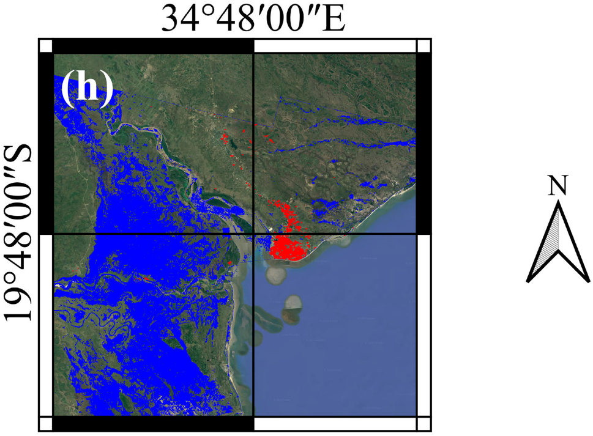
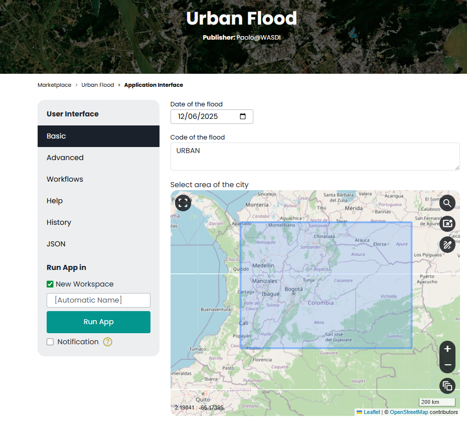
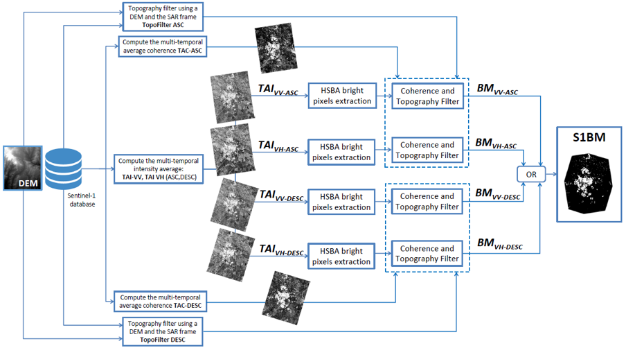
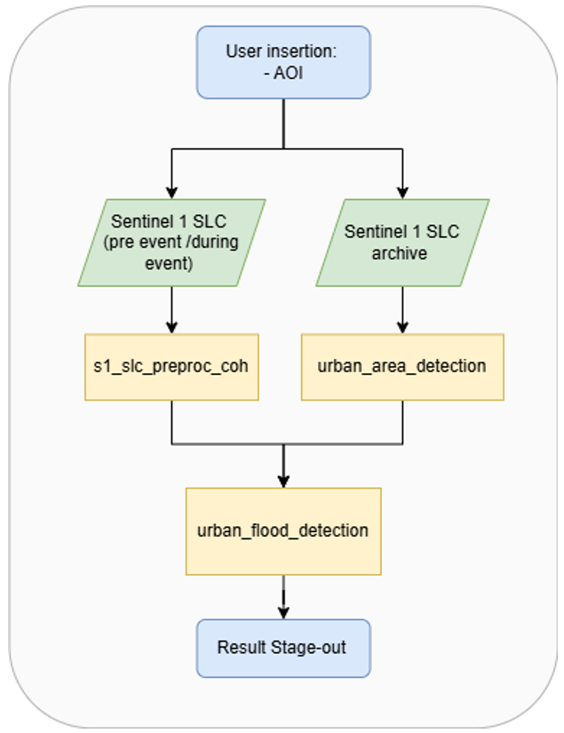
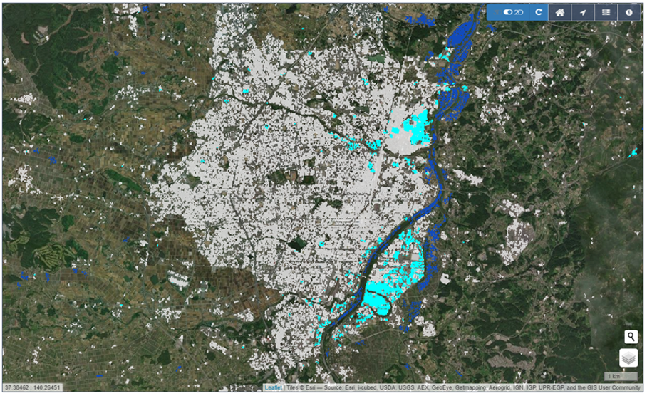

Urban Flood Mapping
=========================================

In urban areas, there are three distinct scattering mechanisms: specular reflection, the double, and multiple bounces.
In the case of specular reflection, the presence of water leads to a decrease in SAR intensity backscattering in both the VV and VH channels.
In the case of double-bounce, the intensity is expected to increase mainly in the VV channel, and the magnitude of the effect depends on the orientation of the building façade with respect to the LoS of the sensor.
The strength of double bounce also depends on the height of the building above the water level: the double bounce effect reduces the difference between the water surface and the height of the surrounding buildings with decreasing elevation and completely disappears when the building is totally submerged.
This means that the interferometric coherence, which shows how two complex observations (amplitude and phase) are related, is a key tool for showing how floodwater changes the surface.

In theory, urban settlements are steady targets with high coherence, even at large temporal baselines.
So, a sudden drop in the multitemporal InSAR coherence in both the VV and VH polarizations shows that floodwater showed up between two image acquisitions.
However, a significant drop in coherence may also occur because of a precipitation cell covering bare soils, thereby potentially causing false alarms in the urban flood maps.

Therefore, it is crucial to carefully select the input features for floodwater mapping across various land cover classes.
Usually, there aren't many labels for the class of urban floodwater, so when supervised approaches are used, there is a substantial chance that self-attention approaches will give less accurate results in terms of how well the trained model holds up against new events in different places.

Thus, it is hypothesized that considering an urban mask provides additional information and potentially contributes to more accurate results.
A possible way to make use of the urban mask is to simply concatenate it with SAR input and then feed them into a semantic segmentation network.
However, such a method may suffer from the distribution bias between the training dataset and the application dataset due to the limited volume/diversity of the training dataset.
This may lead to inefficient use of the SAR-derived urban mask and thus less accurate predictions.
To address this issue, this service adopts an urban-aware module as a way to leverage an additional urban layer to normalize the features learned and the final predictions.
The urban mask provides information about the built-up area’s geometry and the probability of building locations.
Such features can guide the deep neural network toward normalizing features of urban and nonurban flood classes and can thus improve the accuracy of urban flood mapping.
Both the training and testing phases adaptively perform this normalization for each input instance.
Then, the urban-aware module is embedded into a multiscale network architecture, i.e., U-Net, which has a high capacity to generalize at a large scale.

The Urban Flood Mapping (UFM) service exploits multitemporal Sentinel-1 data to derive floodwater extents over bare soil and in urbanized areas.
The algorithm takes complex SLC SAR data from the Sentinel-1 mission as input and uses both intensity and phase information from multimodal SAR data over time and space to quickly and accurately map floodwater.
The algorithm can be applied on a large scale using a comprehensive data set consisting of collections of archived multitemporal satellite imagery from the Sentinel-1 mission.
The algorithm is based on a patented technology (LU500947, 2023/06/02) owned by LIST.
It is implemented in the Copernicus LAC specialized processing environment platform, and stakeholders can access it through a web interface.

The service employs the U-Net architecture together with an innovative urban-aware module that integrates urban-aware attention with channel attention. 
This module uses an urban mask made from multitemporal SAR data to help the network understand the most important factors for classifying different types of floods, such as bare soil floods and urban floods. 
For the service to work, it needs an urban mask made from SAR data, as well as coherence and intensity data from before and after events in both VV and VH polarizations.
The service utilizes a supervised algorithm that relies on a large offline training dataset to effectively train the model.
It requires no additional training during an emergency and can immediately infer the flooded area.
To achieve accurate floodwater maps with a high degree of generalization, it is needed a well-trained model that utilizes a high-quality annotated dataset with significant diversity and volume.
This ensures the model can effectively represent the characteristics of various flooded and non-flooded conditions.
The algorithm has been trained using several events that occurred over diverse geographical areas, and it will constantly be retrained with future flood events in order to increase the diversity of the training dataset and to improve its performance (Zhao et al., 2022) [1]_.

   
   Example of a flood map inferred by the proposed model for the 2019 flood event in Beira (Mozambique). In red are depicted urban flooded areas, mainly Beira City, while in blue bare soil floods.

Worflow
-----------------------------------------

The end user must select the area of interest (AoI) and the first day of the expected flood event to obtain the desired map.

    On the Copernicus LAC specialized processing environment web interface, users can choose the flood day and area of interest.

.. raw:: html

   

Once this information is provided, the service will automatically access the desired Sentinel-1 data, preprocess and coregister them, and in a completely automatic way, it will restitute the final map, which informs on the flooded areas, distinguishing between urban and bare soil areas.
The service makes use of two main data streams: a stack of SLC Sentinel-1 images acquired before the event to derive the urban mask and three SLC SAR images, two before the event and one after the event, to detect floodwater.
All these steps are fully automatic and integrated into the Copernicus LAC specialized processing environment.
Chini et al. (2018) [2_]] describes the algorithm to derive the building mask, while the figure below depicts a sketch of the entire architecture.

    Block diagram of the algorithm that performs the building extraction from multi-temporal synthetic aperture radar (SAR) intensity and InSAR coherence stacks extracted from Sentinel-1 data (Chini at al., 2018) [2]_.

.. raw:: html

   

The system queries the Sentinel-1 archive and automatically selects images that are intersecting the AoI and that fulfill the temporal requirements with respect to the expected flood event, defining automatically which are the images before and those after the event.
The figure below shows the workflow of all images necessary for the detection of floodwater.

    Workflow of the UFM service

.. raw:: html

   

As a side product, the service also provides a building map at 10m spatial resolution that identifies the areas where buildings are present.
The building map product can also be obtained without running the urban floodwater mapping service, and it can be used to update building maps that are globally available, but they are outdated.

    The final floodwater map is overlaid over the building map (in white), also derived from the service. The map displays dark blue floodwater on bare soil and light blue floodwater in urban areas.

Input
-----------------------------------------

The UFM service requires in input:

* Sentinel-1 SLC dual-pol data: The service uses a stack of 6 months of Sentinel-1 SLC acquisitions over the AoI to derive the building mask. 
  The images are those acquired before the flood event. Starting from SLC data, all orbits and all polarizations will be processed to extract the average value of coherence and intensity over the 6-month stack to use as input for deriving the building map.

* Sentinel-1 SLC dual-pol data: The service uses three Sentinel-1 SLC images—two acquired before the event and one acquired after it—to derive the floodwater map. 
  The images are used to derive the pre-event using the two images acquired before and the co-event coherence using one image acquired before and one after the event and the pre- and post-intensity images. All these features are extracted in both VV and VH polarizations, deriving a total of 8 features as input for the deep-learning model.

Parameters
-----------------------------------------

The UFM service requires a specified number of mandatory parameters. The following table describes these parameters. 
These are defined by the user via a web interface as shown in the figure above.

.. list-table:: Parameters for the UFM processor
   :name: tab:ufm_parameters
   :widths: 20 55 10 10
   :header-rows: 1

   * - **Parameter**
     - **Description**
     - **Required**
     - **Default**
   * - **Date**
     - Date from which the flood event is expected. The inserted date is used as the start date to select the two images before and the one after the event, and to derive the pre-event 6-month Sentinel-1 data stack to derive the building map.
     - YES
     - 
   * - **Area of interest (AoI)**
     - Area of interest to be covered by the service
     - YES
     - 

Output
-----------------------------------------

**Product A: Floodwater map**

* *Definition*: Detection of areas where the floodwater is standing, both in urban and bare soil areas.
* *Data type*: Geospatial layers 
* *Format*: raster

**Product B: Building map**

* *Definition*: Mapping and classification of buildings
* *Data type*: Geospatial layer  
* *Format*: raster
  
.. raw:: html

   

* *Spatial resolution*: 20m.
* *Frequency*: 3/4 days, depensding on the availability of Sentinel-1 data. 
* *Spatial coverage*: depending on the availability of resources, the area of interest can be by selected the final user. The system is potentially extendible to the whole LAC region. 

References
-----------------------------------------

.. [1] Zhao J., Li Y., Matgen P., Pelich R., Hostache R., Wagner W., Chini M., Urban-Aware U-Net for Large-Scale Urban Flood Mapping Using Multitemporal Sentinel-1 Intensity and Interferometric Coherence, IEEE Transactions on Geoscience and Remote Sensing, vol. 60, art. no. 4209121, 2022.  doi:10.1109/TGRS.2022.3199036
.. [2] M. Chini, R. Pelich, R. Hostache , P. Matgen, C. Lopez-Martinez,  Towards a 20 m Global Building Map from Sentinel-1 SAR Data, Remote Sensing, 2018, 10, 1833; doi:10.3390/rs10111833 

