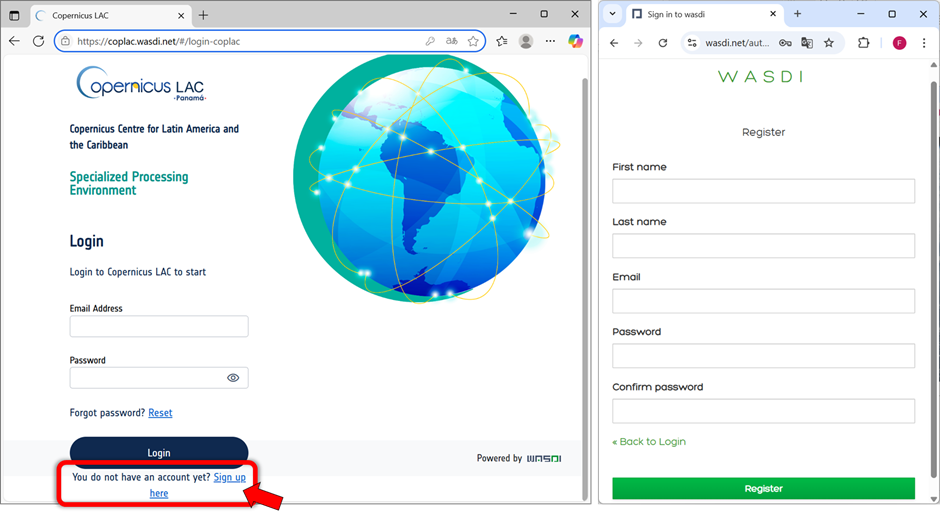
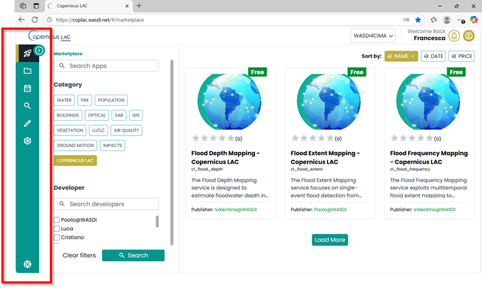
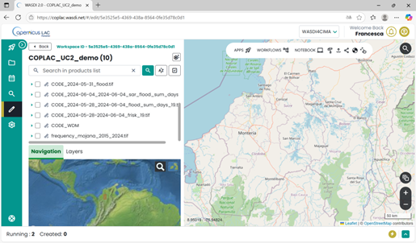
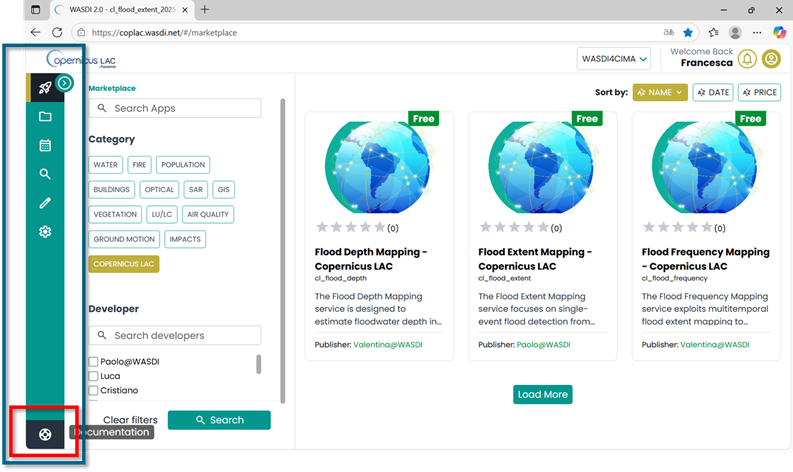
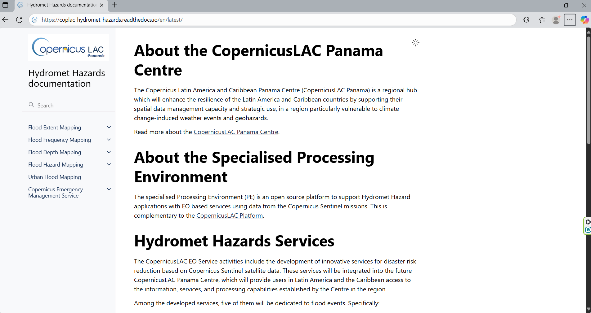

ES - El entorno de procesamiento especializado (Specialised PE)
===============================================================

La página de inicio del entorno de procesamiento especializado (Specialised PE) de CopernicusLAC está disponible en el siguiente enlace: :raw-html:`<a href="https://coplac.wasdi.net/" target="_blank">https://coplac.wasdi.net/</a>`.
Para acceder al Specialised PE con los servicios y datos desarrollados, primero debe crear su cuenta.

* El Specialised PE está disponible a través de: :raw-html:`<a href="https://coplac.wasdi.net/#/login-coplac" target="_blank">https://coplac.wasdi.net/#/login-coplac</a>` 
* Haga clic en **¿Aún no tiene una cuenta?** :raw-html:`<a href="https://www.wasdi.net/auth/realms/wasdi/protocol/openid-connect/registrations?client_id=wasdi_client&redirect_uri=https%3A%2F%2Fwww.wasdi.net%2F%23%2Flogin&state=74f70630-4138-4022-94fd-1b9743ca5175&response_mode=fragment&response_type=code&scope=openid&nonce=e55a5a23-1292-40d2-8674-267fbaf12950" target="_blank">Sign up here</a>` link

    Página de inicio de sesión y formulario de registro de lo Specialised PE CopernicusLAC

* **Rellene el formulario de inscripción** con la siguiente información:

  * Nombre, Apellido 
  * una dirección de correo electrónico válida (que se utilizará como su **ID de usuario**)
  * password

* Confirma su dirección de correo electrónico: Recibirá un correo electrónico de confirmación (consulte también la carpeta SPAM.). Haga clic en el enlace que aparece en ese correo electrónico para verificar su dirección. Una vez confirmada, podrá acceder a la plataforma Specialised PE.
* Después de registrarse, envíe un correo electrónico a business-team@wasdi.cloud con la siguiente información:

  * Confirmación de que se ha registrado en la plataforma. 
  * **Dirección de correo electrónico** que utilizó durante el registro
  * Mencione que es usuario de **CopernicusLAC**.
  
Este último paso es necesario para poder asignarle la suscripción correcta.

Después de registrarse, puede iniciar sesión con sus credenciales.
Se le redirigirá a la página **Marketplace** (:raw-html:`<a href="https://coplac.wasdi.net/#/marketplace" target="_blank">https://coplac.wasdi.net/#/marketplace</a>`), 
donde se enumeran las **aplicaciones/servicios** disponibles.

.. figure:: _static/common/5_tutorial_marketplace.png
    :alt: marketplace
    :align: center
    :figwidth: 80%
    :name: marketplace

    CopernicusLAC Specialised PE Marketplace

Descripción general de la interfaz gráfica del entorno de procesamiento especializado (Specialised PE)
-------------------------------------------------------------------------------------------------------

Esta sección ofrece una descripción general de los componentes clave y el diseño de la interfaz de usuario del entorno de procesamiento especializado (Specialised PE).
El menú principal siempre está visible en la barra verde situada en la parte izquierda de la interfaz, lo que le permite navegar por las distintas secciones de la plataforma.

    CopernicusLAC Specialized PE menú principal

* **Marketplace**: página donde todas las aplicaciones están disponibles para los usuarios finales con una interfaz sencilla e intuitiva. Elija su aplicación, introduzca los datos de ingreso y obtenga los resultados.

.. figure:: _static/common/7_tutorial_main_menu_marketplace.png
    :alt: menu
    :align: center
    :figwidth: 80%
    :name: fig:menu_marketplace_es

    CopernicusLAC Specialized PE menú principal – Marketplace

* **Workspaces**: Cada usuario puede trabajar en uno o más espacios de trabajo (workspace). Un espacio de trabajo es una colección de archivos (ya sean datos originales de observación de la Tierra (EO) o resultados generados por herramientas de procesamiento) agrupados bajo el mismo «proyecto». Desde la sección Workspaces, puede:
  
  * Crear un nuevo espacio de trabajo
  * Abrir un espacio de trabajo existente desde la lista desplegable de espacios de trabajo a los que tiene acceso su cuenta.

.. figure:: _static/common/8_tutorial_main_menu_workspace.png
    :alt: menu
    :align: center
    :figwidth: 80%
    :name: fig:menu_workspace_es

    CopernicusLAC Specialized PE menú principal – Workspaces

A continuación se muestra un ejemplo de un espacio de trabajo existente, con la lista de capas disponibles a la izquierda y un mapa base a la derecha, donde se pueden visualizar las capas seleccionadas.

    CopernicusLAC Specialized PE – Ejemplo de espacio de trabajo (workspace)

* **Documentación**: las especificaciones detalladas de los servicios Hydromet Hazard Services están siempre disponibles a través del enlace «Documentación» del menú principal.

    CopernicusLAC Specialized PE menú principal – Documentación

.. raw:: html

     

   CopernicusLAC documentación de los servicios de riesgos hidrometeorológicos