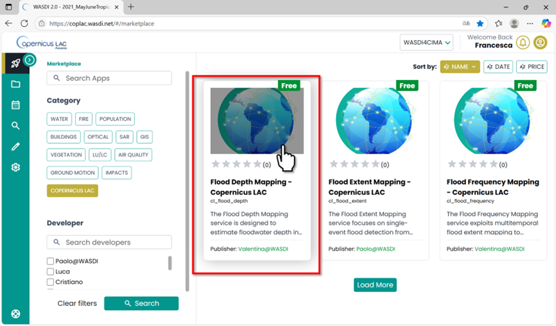
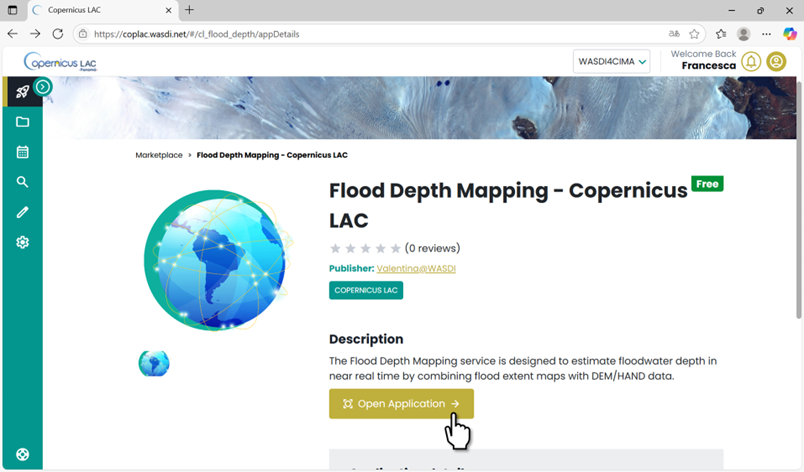
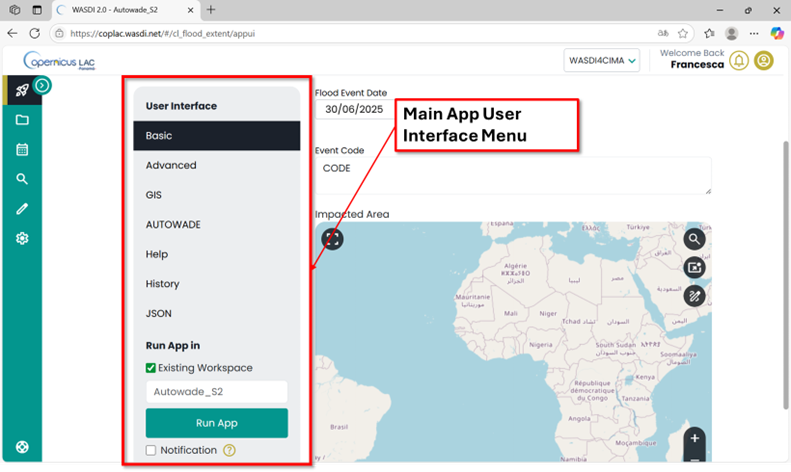
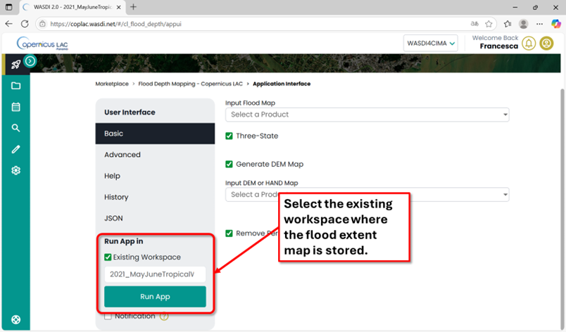
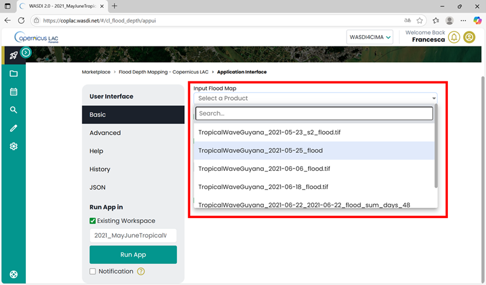
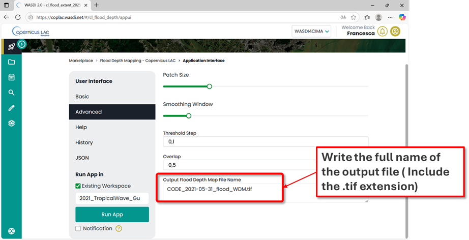
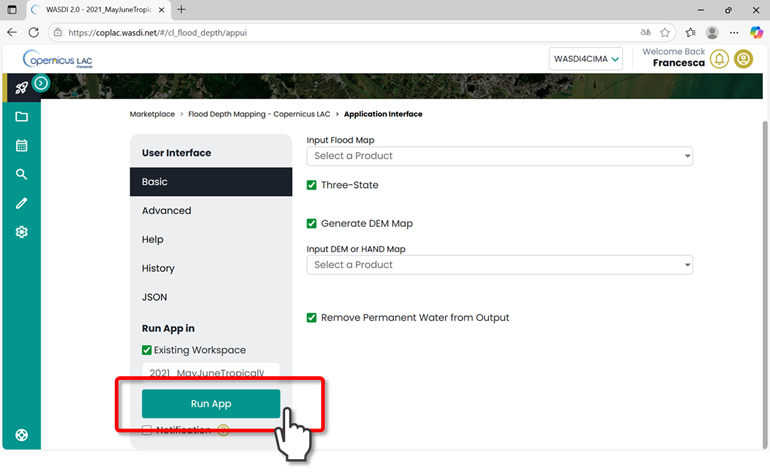
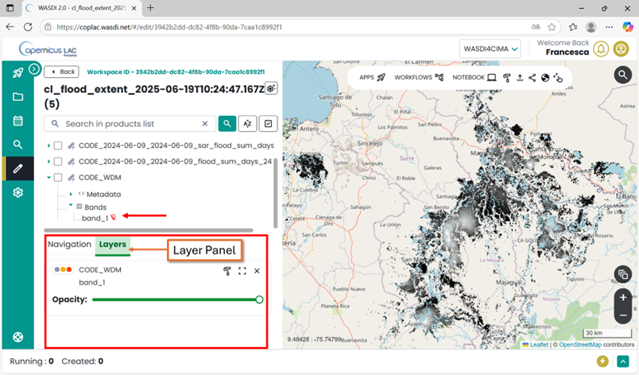
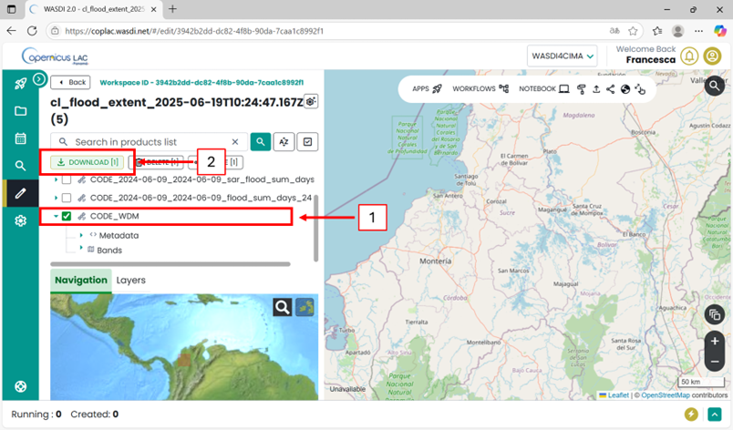

Flood Depth Mapping Tutorial
=========================================

Service Summary
-----------------------------------------

The Flood Depth Mapping (FlDM) tool enables users to create comprehensive flood depth maps for designated areas and timeframes.
The system autonomously extracts water depth in urban and rural regions.
It accomplishes this by utilizing a floodwater map and either a Digital Elevation Model or an alternative Height Above Nearest Drainage (HAND), according on which is superior in terms of quality.
In terms of geophysical products, the FLDM service generates on demand flood water depth maps in decimetres.

The Flood Depth Mapping App
---------------------------------------------------

Select the Flood Depth Mapping Service App in the marketplace:

    Flood Depth Mapping App in the CopernicusLAC Specialized PE Marketplace

Open the application:

    FLDM App in the CopernicusLAC Specialized PE Marketplace. Open Application.

FlDM Application Menu
^^^^^^^^^^^^^^^^^^^^^^^^^^^^^^^

Every app has its **Main Menu** on the left side of the user interface. 
This is where you can access different tabs to configure parameters for running the app.

    Flood Extent Mapping Service User Interface

The **Flood Depth Mapping** service requires a **flood extent map** as input. 
This means you must run the app in the **workspace where the flood extent map is stored**.

To begin:

* Scroll to the bottom of the **Main Menu**.
* In the **“Run App in”** section, select the **“Existing Workspace”** option.
* A dropdown menu will appear, allowing you to choose from your previously created workspaces.
* Select the workspace that contains the flood extent map for which you want to compute water depth.

**Note**: If you haven’t already generated a flood extent map in your workspace, you can create one using the **Flood Extent Mapping Service App**: https://coplac.wasdi.net/#/cl_flood_extent/appDetails.

    Main menu of the FlDM app. Select from the list the workspace where you want to run the app.

Basic
"""""""
Fill in **Basic** parameters (required as mandatory to run the app)

* **Input flood map**: Select the flood extent map from the dropdown list showing the available layers in the selected workspace.
* **Three-state** (*default:True*). Leave this option selected if you are using flood maps produced by the **Flood Extent Mapping Service**, which classify pixels into three categories: no flood, flood, and permanent water. If you are using your own flood extent map and it is a binary map (water / no water), deselect this option.
* **Generate DEM Map** (*default: True*): When selected, the app will automatically extract a DEM over the extent of the input flood map. If you already have your own DEM or HAND layer, you can deselect this option.
* **Input DEM or HAND Map** (*optional*): If you choose not to generate the DEM automatically, you can select your own **DEM** or **HAND** layer here. Please note:
  
  * Your DEM/HAND layer must already be available in your workspace, which means you need to have uploaded it from your device to your Specialized PE workspace in advance.
  * The DEM must cover **the same area** as the flood extent map used for flood depth computation.

* **Remove Permanent Water from the Output** (*default: True*): set this option to compute the water depth only on flooded areas.

    Basic parameters to set to run the FlDM app: Input flood extent map

.. raw:: html

     

.. figure:: ../_static/flood_depth/17_tutorial_params_2.png
    :alt: app basic input 2
    :align: center
    :figwidth: 80%
    :name: fig:app_basi_input_2

    Basic parameters to set to run the FlDM app

Advanced
"""""""""""

In the Advanced Parameters section, you’ll find additional settings. 
Among other parameters that can be modified by expert users (Patch Size and Smoothing Window), user should assign here the name to the output file. 
If the Name is not specified and automatic one will be assigned. 

    FlDM App - Advanced Parameters

Advanced parameters, that should be modified by expert users:

* *Patch Size (default: 512 pixels)*: Size of each patch for individual analysis (in pixels).
* Smoothing (*default: 256 pixels*): Window size for smoothing threshold transitions between patches. Set to 0 to disable.
* *Threshold Step (default: 0.1)*: Increment step size used for threshold optimization search 
* *Overlap (default: 0.0)*: Pixel overlap ratio between adjacent patches to minimize edge effects. (between 0 and 1).

Once all parameters are set, click the **“Run App”** button in the Main Menu. 
The platform will automatically redirect you to the workspace you selected—either an existing one or the newly created workspace.

    FlDM Service: Run App after setting parameters

In the workspace where the app is running, you can check at any time the status of its execution by clicking on the arrow at the bottom-right corner.

.. figure:: ../_static/common/20_tutorial_app_status.png
    :alt: app status
    :align: center
    :figwidth: 80%
    :name: fig:app_status

    CopernicusLAC Specialized PE workspace view – check status of the apps

“Created”, “Running”, “Ready” or “Waiting” states indicate that the application is still in its execution phase.
“Done”, “Error” or “Stopped” states represent that the execution of the application has ended.

.. figure:: ../_static/common/21_tutorial_app_summary.png
    :alt: app summary
    :align: center
    :figwidth: 80%
    :name: fig:summary

    CopernicusLAC Specialized PE workspace view - Details about the execution of an app

Output, data visualization and download
---------------------------------------------------

The service will produce as output the following GeoTIFF:

* flood water depth map expressed in decimetres

**How to display data in your workspace in the Specialized PE?**

* Find your layer of interest in your workspace, expand the selection and toggle on the layer of interest and click on the lightbulb icon.
* The selected layer will be displayed on the map, and the product should appear in the list of products in the Layer panel.

    CopernicusLAC Specialized PE map visualization.

**How to download data from your workspace in the Specialized PE?**

* Access your CopernicusLAC Specialized PE workspace
* Find your layer of interest in your workspace and select it. The download option will appear on top the layer list. 

    CopernicusLAC SpecializedPE data download
    