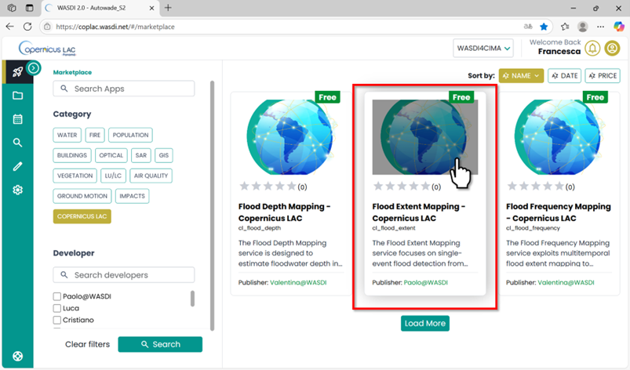
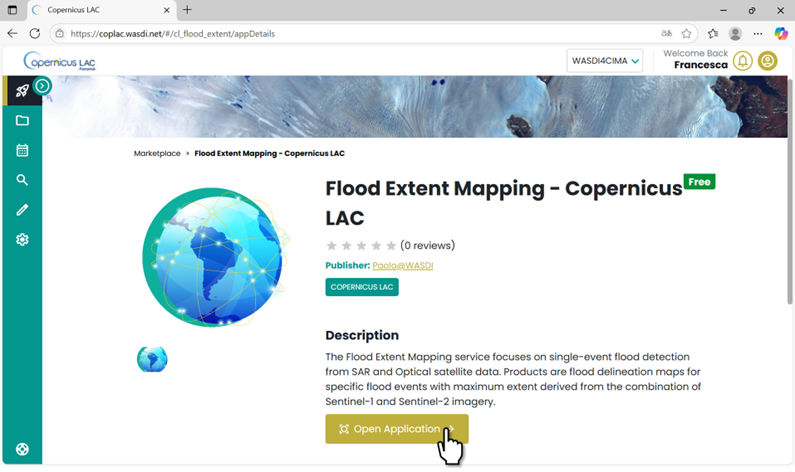
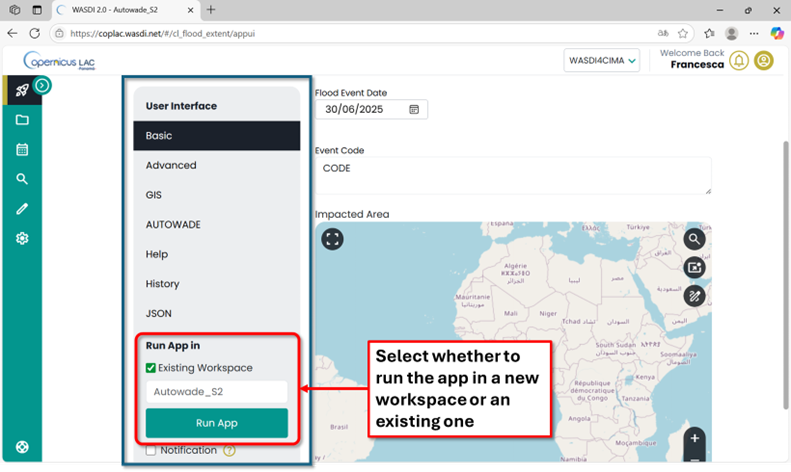
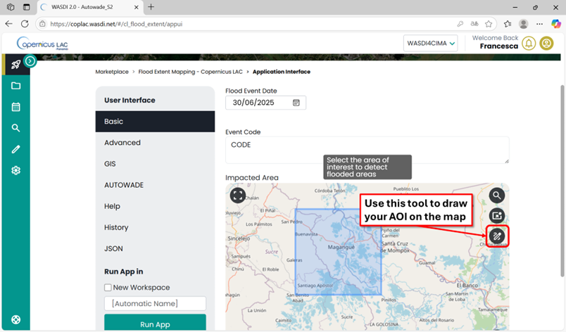
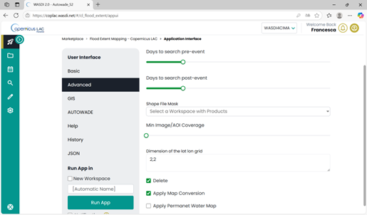
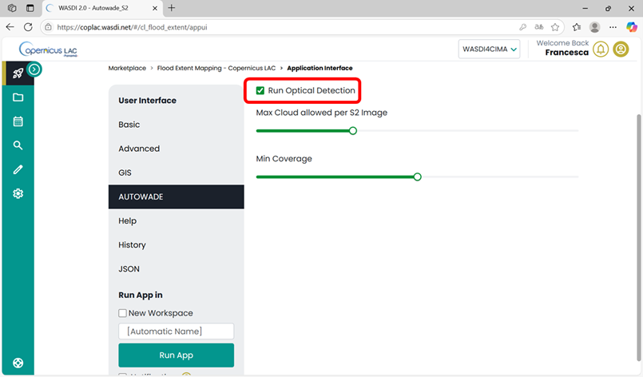
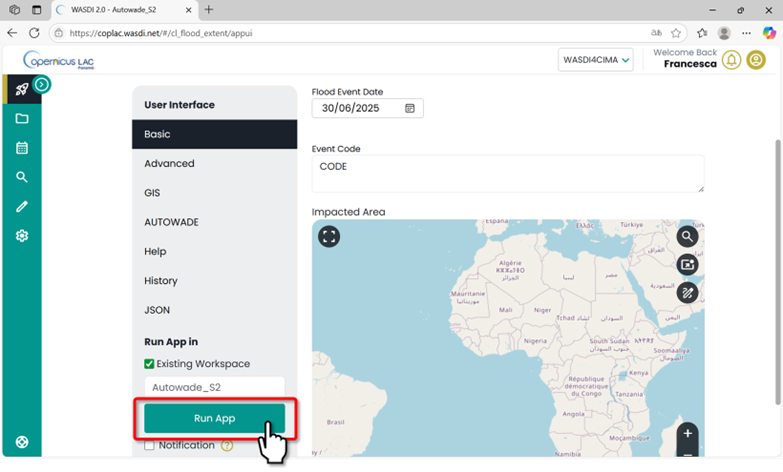
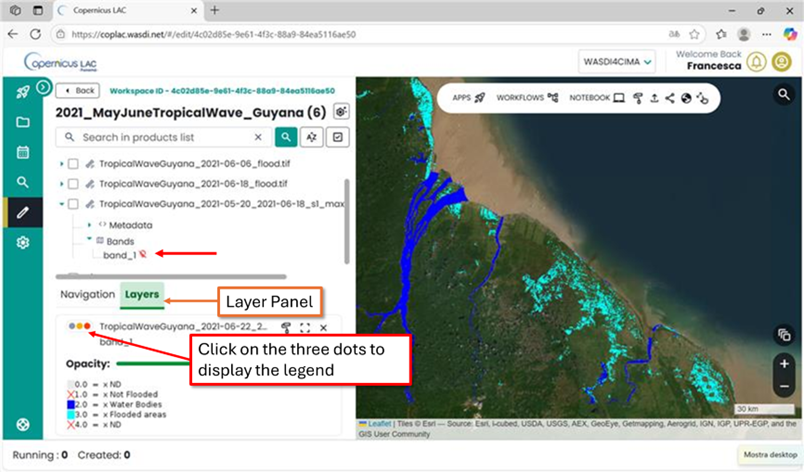

Flood Extent Mapping Tutorial
=========================================

Serivice Summary
-----------------------------------------

This service focuses on detecting floods over a period around a specific date (event start date) in a specific Area of Interest (AOI) defined by the user; it uses SAR and Optical Flood Extent Detection processors developed by CIMA Foundation. 
The user specifies an AOI and sets the start date of the flood event. 
A default observation/acquisition period is applied automatically, but it can be adjusted as needed. 
The service automatically searches pre- and post-event Sentinel-1 images with the same geometry and post-event Sentinel-2 images covering the AOI. 
The service extracts the Land Cover map and Water Bodies map in the same area and triggers the execution of the SAR Flood Extent Detection and Optical Flood Extent Detection for each satellite image found. 
As a result, flood extent maps are generated for each observation and a maximum extent map is provided as the cumulative sum of these maps.

Access the platform
-----------------------------------------

The landing page of the CopernicusLAC Specialized PE is available at: https://coplac.wasdi.net/ .
To access the Specialized PE with the developed services and data, you first need to create your account.

* The Specialized PE is available through: https://coplac.wasdi.net/#/login-coplac
* Click on the **You do not have an account yet?** `Sign up here`_ link.

.. _Sign up here: https://www.wasdi.net/auth/realms/wasdi/protocol/openid-connect/registrations?client_id=wasdi_client&redirect_uri=https%3A%2F%2Fwww.wasdi.net%2F%23%2Flogin&state=74f70630-4138-4022-94fd-1b9743ca5175&response_mode=fragment&response_type=code&scope=openid&nonce=e55a5a23-1292-40d2-8674-267fbaf12950

.. figure:: ../_static/common/4_tutorial_sign_in.png
    :alt: sign in
    :align: center
    :figwidth: 80%
    :name: fig:flood_event_sign_in

    CopernicusLAC Specialized PE Login page and Sign-up form

* **Fill out the registration form** with the following information:

  * First Name, Last Name 
  * a valid e-mail address (that will be used as your **UserId**)
  * password

* Confirm your email address: You will receive a confirmation email. Click the link in that email to verify your address. Once confirmed, you will be able to access the SpecializedPE platform.
* After registering, please send an email to business-team@wasdi.cloud with the following information:

  * Confirmation that you have registered on the platform. 
  * **Email address** you used during registration
  * Note stating that you are a **CopernicusLAC user**.
  
This last step is necessary so we can assign you the appropriate subscription.

After registering, you can log in with your credentials. 
You will be redirected to the **Marketplace** page (https://coplac.wasdi.net/#/marketplace), where the available **Service Applications** are listed.

.. figure:: ../_static/common/5_tutorial_marketplace.png
    :alt: marketplace
    :align: center
    :figwidth: 80%
    :name: fig:flood_event_marketplace

    CopernicusLAC Specialized PE Marketplace

Overview of the Specialized PE graphical interface
---------------------------------------------------

This section provides a general overview of the key components and layout of the Specialized Processing Environment (PE) user interface.
The main menu is always visible on the green bar on the left-hand side of the interface, allowing you to navigate through the various sections of the platform.

.. figure:: ../_static/common/6_tutorial_main_menu.png
    :alt: menu
    :align: center
    :figwidth: 80%
    :name: fig:flood_event_menu

    CopernicusLAC Specialized PE main menu

* **Marketplace**: page where all the applications are available for end users with a simple and intuitive Interface. Choose your App, set your input data and get your results.

.. figure:: ../_static/common/7_tutorial_main_menu_marketplace.png
    :alt: menu
    :align: center
    :figwidth: 80%
    :name: fig:flood_event_menu_marketplace

    CopernicusLAC Specialized PE main menu – Marketplace

* **Workspaces**: each user can work in one or more Workspaces. A Workspace is a collection of files (either original Earth Observation (EO) data or outputs generated by processing tools) grouped under the same “project.” From the Workspace section, you can:
  
  * Create a new workspace
  * Open an existing workspace from the dropdown list of workspaces your account has access to

.. figure:: ../_static/common/8_tutorial_main_menu_workspace.png
    :alt: menu
    :align: center
    :figwidth: 80%
    :name: fig:flood_event_menu_workspace

    CopernicusLAC Specialized PE main menu – Workspaces

Below is an example of an existing workspace, showing the list of available layers on the left and a basemap on the right, where selected layers can be visualized.

.. figure:: ../_static/common/9_tutorial_workspace_example.png
    :alt: workspace example
    :align: center
    :figwidth: 80%
    :name: fig:flood_event_workspace_example

    CopernicusLAC Specialized PE – Example of workspace

* **Documentation**: detailed specifications of the Hydromet Hazard Services are always accessible via the documentation link in the main menu.

.. figure:: ../_static/common/10_tutorial_main_menu_documentation.png
    :alt: menu
    :align: center
    :figwidth: 80%
    :name: fig:flood_event_menu_documentation

    CopernicusLAC Specialized PE main menu – Documentation

.. raw:: html

     

.. figure:: ../_static/common/11_tutorial_online_docs.png
   :alt: documentation
   :align: center
   :figwidth: 80%
   :name: fig:flood_event_documentation

   CopernicusLAC Hydromet Hazards Services Documentation

The Flood Extent Mapping App
---------------------------------------------------

Select the Flood Extent Mapping Service App in the marketplace:

    Flood Extent Mapping App in the CopernicusLAC Specialized PE Marketplace

Open the application:

    FEM App in the CopernicusLAC Specialized PE Marketplace. Open Application

FEM Application Menu
^^^^^^^^^^^^^^^^^^^^^^^^^^^^^^^

Every app has its **Main Menu** on the left side of the user interface. 
This is where you can access different tabs to configure parameters for running the app.

.. figure:: ../_static/flood_event/7_tutorial_app_ui.png
    :alt: app ui
    :align: center
    :figwidth: 80%
    :name: fig:fem_app_ui

    Flood Extent Mapping Service User Interface

To begin, scroll to the bottom of the **Main Menu** and:

* **Select whether to run the app in a new workspace or an existing one.**
  
  * If you select **Existing Workspace**, a dropdown menu will appear, allowing you to choose from the workspaces you’ve already created.
  * If you choose **New Workspace**, you can either assign a custom name or let the system automatically generate one for you [Automatic Name].

    Main menu of the FEM app. Select if you want to run the app in a new workspace or in an existing one

Basic
"""""""

Fill **Basic** parameters (required as mandatory to run the app)

* **Flood Event Date**: Date when the flood event started. Post-event images will be searched starting from this date onward. 
* **Event Code**: Prefix to use to name output files. Do not use underscore.
* In the **Impacted Area** draw the area in which you want to make your analysis, e.g over the Mojana Region in Colombia.

    Basic parameters to set to run the FEM app

Advanced
"""""""""""

In the Advanced Parameters section, you’ll find additional settings that can be modified by expert users. These parameters are not mandatory to run the app. 
The following options are available:

* *Days to search pre-event*: Number of days before the Flood Event Date to search for pre-event images (excluding the Flood Event Date). Default: 20 days
* *Days to search post-event*: Number of days after the Flood Event Date to search for post-event images (including the Flood Event Date). Default: 20 days
* *Delete*: Keep this option selected to delete intermediate files. Deselect it if you want to retain all intermediate files.
* *Apply permanent water*: The algorithm includes permanent water computation by default. Enable this option if you want to explicitly apply it to the output using a reference thematic layer.

    FEM App – Advanced Parameters

AUTOWADE
"""""""""""

In the AUTOWADE tab, you can choose to run flood mapping using both SAR and optical data.

To enable this, select the “Run Optical Detection” option.

When this option is checked, the Flood Extent Mapping App will automatically launch both the autowade_S1 (SAR-based) and autowade_S2 (optical-based) processing workflows.

    FEM App – AUTOWADE tab with parameters for enabling optical flood mapping

In this section, you can set parameters to refine the search for images used in the application. 
The parameters you can adjust from their default values include:

* *Max Cloud Allowed per S2*: Specifies the maximum cloud coverage allowed for Sentinel-2 optical images to be considered in the analysis.
* *Min Coverage*: Defines the minimum percentage of a Sentinel-2 image that must cover the area of interest to be included.

Once all parameters are set, click the **“Run App”** button in the Main Menu. 
The platform will automatically redirect you to the workspace you selected—either an existing one or the newly created workspace.

    FEM Service: Run App after setting parameters

In the workspace where the app is running, you can check at any time the status of its execution by clicking on the arrow at the bottom-right corner.

.. figure:: ../_static/common/20_tutorial_app_status.png
    :alt: app status
    :align: center
    :figwidth: 80%
    :name: fig:fem_app_status

    CopernicusLAC Specialized PE workspace view – check status of the apps

“Created”, “Running”, “Ready” or “Waiting” states indicate that the application is still in its execution phase.
“Done”, “Error” or “Stopped” states represent that the execution of the application has ended.

.. figure:: ../_static/common/21_tutorial_app_summary.png
    :alt: app summary
    :align: center
    :figwidth: 80%
    :name: fig:fem_summary

    CopernicusLAC Specialized PE workspace view - Details about the execution of an app

Output, data visualization and download
---------------------------------------------------

The service will produce as output the following GeoTIFF:

* Flood extent map: one map for each day with a valid SAR image. Called [CODE]_[DATE]_flood (Legend 1)
* SAR max extent (Maximum extent of all flood maps from Sentine-1), called [CODE]_[DATE]_sar_flood_sum_days[TOT] (Legend 1)
* Optical flood composite, called [CODE]_[DATE]_s2_flood (Legend 1)
* SAR and Optical Max extent map, called [CODE]_[DATE]_flood_sum_days[TOT] (Legend 1)
* Comparative optical and SAR flood map. called [CODE]_[DATE]_frisk[DAYS] (Legend 2)

*Legend 1:*

0 - No data

1 - No flood

2- Permanent water

3 - Flooded areas

*Legend 2:*

0 - No Data 

1 - No Flood

2 - One Map flood, the other oe not flood

3 - One Map flood, the other one no data

4 - Both Maps flood

5 - Permanent water

**How to display data in your workspace in the Specialized PE?**

* Find your layer of interest in your workspace, expand the selection and toggle on the layer of interest and click on the lightbulb icon.
* The selected layer will be displayed on the map, and the product should appear in the list of products in the Layer panel.

    CopernicusLAC Specialized PE map visualization

**How to download data from your workspace in the Specialized PE?**

* Access your CopernicusLAC Specialized PE workspace
* Find your layer of interest in your workspace and select it. The download option will appear on top the layer list. 

.. figure:: ../_static/flood_event/14_tutorial_download.png
    :alt: map download
    :align: center
    :figwidth: 80%
    :name: fig:fem_download

    CopernicusLAC SpecializedPE data download
