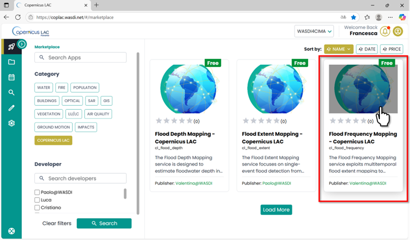
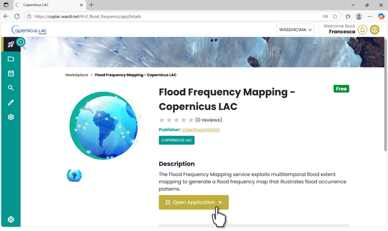
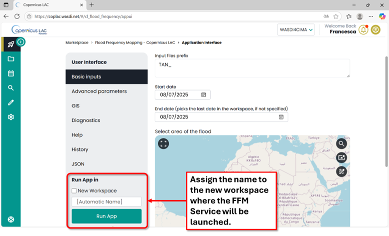
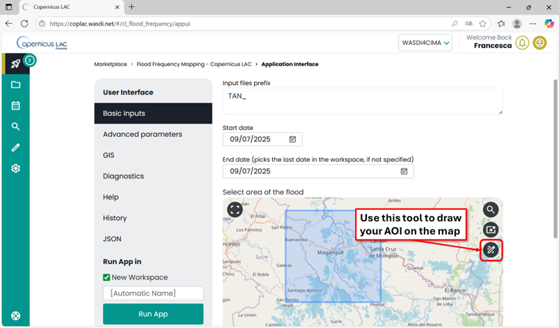
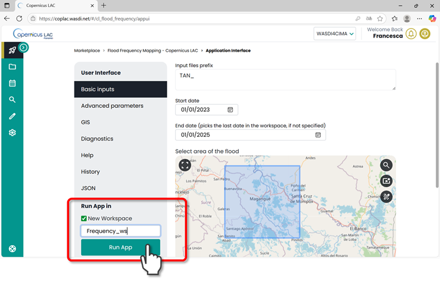
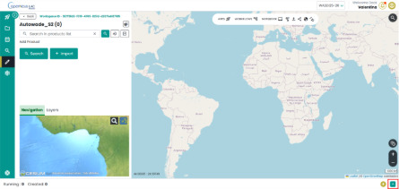
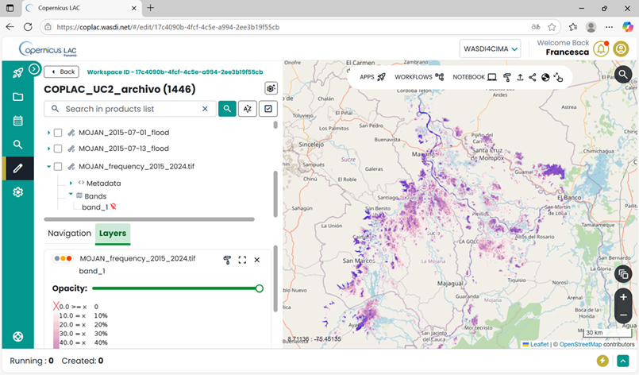

Flood Frequency Mapping Tutorial
=========================================

Service Summary
-----------------------------------------

The Flood Frequency Mapping (FFM) service exploits multitemporal flood extent mapping to generate a flood frequency map that illustrates flood occurrence patterns. 
The service relies on flood maps derived from both optical (Sentinel-2 L2A) and SAR (Sentinel-1 GRD) satellite data. 
These are systematically analyzed over a user-defined archive, based on a selected start and end date and an Area of Interest (AOI).

The Flood Frequency Mapping App
---------------------------------------------------

Select the Flood Frequency Mapping Service App in the marketplace:

    Flood Frequency Mapping App in the CopernicusLAC Specialized PE Marketplace

Open the application:

    Flood Frequency Mapping App in the CopernicusLAC Specialized PE Marketplace. Open Application

FFM  Application Menu
^^^^^^^^^^^^^^^^^^^^^^^^^^^^^^^

Every app has its **Main Menu** on the left side of the user interface. 
This is where you can access different tabs to configure parameters for running the app.

.. figure:: ../_static/flood_frequency/5_tutorial_ui.png
    :alt: app ui
    :align: center
    :figwidth: 80%
    :name: fig:ffm_app_ui

    Flood Frequency Mapping Service User Interface.

To begin, scroll to the bottom of the Main Menu and:

* **Select whether to run the app in a new workspace or an existing one.**
  
  * If you select **Existing Workspace**, a dropdown menu will appear, allowing you to choose from the workspaces you’ve already created.
  * If you choose **New Workspace**, you can either assign a custom name or let the system automatically generate one for you [Automatic Name].

Since the Flood Frequency Map generates a large volume of data, **we strongly recommend running the app in a new workspace**.

    Main menu of the FFM app. Run the app in a new workspace

Basic
"""""""

Fill in **Basic** parameters (required as mandatory to run the app)

* **Event Code**: Prefix to use to name output files. 
* **Start date**: The earliest date from which satellite data (Sentinel-1 and Sentinel-2) will be analyzed. This defines the beginning of the archive period for flood detection.
* **End date**: The latest date up to which satellite data will be included in the analysis. This defines the end of the archive period.
* **Select Area of the Flood**: Use the drawing tool to define the Area of Interest (AOI) where you want to perform the analysis (e.g., within the Mojana Region in Colombia).
  

    Basic parameters to set to run the FFM app

Once all parameters are set, click the “Run App” button in the Main Menu. 
The platform will automatically redirect you to the workspace you selected—either an existing one or the newly created workspace.

In the workspace where the app is running, you can check at any time the status of its execution by clicking on the arrow at the bottom-right corner.

    CopernicusLAC Specialized PE workspace view – check status of the apps

“Created”, “Running”, “Ready” or “Waiting” states indicate that the application is still in its execution phase.
“Done”, “Error” or “Stopped” states represent that the execution of the application has ended.

.. figure:: ../_static/common/21_tutorial_app_summary.png
    :alt: app summary
    :align: center
    :figwidth: 80%
    :name: fig:ffm_summary

    CopernicusLAC Specialized PE workspace view - Details about the execution of an app

Output, data visualization and download
---------------------------------------------------

The service will produce as output the following GeoTIFF:

* **Flood extent map**: one map for each day with a valid SAR image. Called TAN_[DATE]_flood (Legend 1)
* **Flood extent map**: one map for each day with a valid optical image, called TAN_[DATE]_s2_flood (Legend 1)
* **CountMapFlood_S1**: Count of how many times the pixel was flooded according to the Sentinel-1 derived flood maps
* **CountMapData_S1**: Count how many times the pixel was observed in the Sentinel-1 derived flood maps.
* **Frequency_S1**: Shows the relative frequency of flooding from Sentinel-2 data, calculated as (CountMapFlood_S1/ CountMapData_S1).
* **CountMapFlood_S2**: Count of how many times the pixel was flooded according to the Sentinel-2 derived flood maps
* **CountMapData_S2**: Count how many times the pixel was observed in the Sentinel-2 derived flood maps
* **Frequency_S2**: Shows the relative frequency of flooding from Sentinel-2 data, calculated as (CountMapFlood_S2/ CountMapData_S2).
* **Frequency**: Overall frequency map combining Sentinel-1 and Sentinel-2 derived flood frequencies, with the frequency expressed aa percentage [0-100%].

*Legend 1*:

    0 - No Data

    1 - No Flood  

    2 - Permanent Water

    3 - Flooded Areas
 
You can either visualize the layers directly within the Specialized PE workspace or download them to your local device for further processing.

**How to display data in your workspace in the Specialized PE?**

* Find your layer of interest in your workspace, expand the selection and toggle on the layer of interest and click on the lightbulb icon.
* The selected layer will be displayed on the map, and the product should appear in the list of products in the Layer panel.

.. figure:: ../_static/flood_frequency/9_tutorial_layer.png
    :alt: app tutorial layer
    :align: center
    :figwidth: 80%
    :name: fig:ffm_panel

    CopernicusLAC Specialized PE map visualization.

**How to download data from your workspace in the Specialized PE?**

* Access your CopernicusLAC Specialized PE workspace
* Find your layer of interest in your workspace and select it. The download option will appear on top the layer list. 

.. figure:: ../_static/flood_frequency/10_tutorial_download.png
    :alt: app download
    :align: center
    :figwidth: 80%
    :name: fig:ffm_download

    CopernicusLAC SpecializedPE data download

An example of the Flood Frequency Mapping workspace produced for Use Case 2 (Mojana - Colombia) is shown below. 
In this case, the service is delivered and automatically updated as new satellite data become available.
The workspace includes a complete list of flood extent maps generated from all available satellite images acquired between 2015 and the present, 
along with the final flood frequency map, which summarizes flood occurrence over the entire period.

.. figure:: ../_static/flood_frequency/11_tutorial_example_1.png
    :alt: map
    :align: center
    :figwidth: 80%
    :name: fig:ffm_map_1

    FFM Workspace – Example of the Flood Extent Maps produced with the FFM Service produced for the Mojana region in Colombia

.. raw:: html

     

    FFM Workspace – Example of the Flood Frequency Map produced for the Mojana region in Colombia (2015-2024)

    